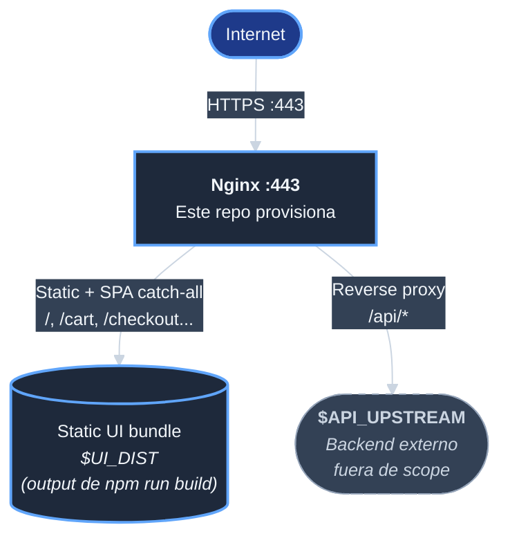

# template-ecomerce-ui-server

Repositorio de infraestructura de servidor web para servir el
build de produccion del template
[`template-e-comerce-ui`][repo-ui]. Proyecto hermano: provisiona
un Ubuntu listo para servir el UI React via Nginx + SSL
Let's Encrypt + fail2ban + SSH hardening.

| Campo | Valor |
|-------|-------|
| Naturaleza | Devops / aprovisionamiento de servidor Linux |
| OS objetivo | Ubuntu 24.04 LTS |
| Stack | Nginx + SSL via [`acme.sh`][acme-sh] + fail2ban + UFW |
| Proyecto al que sirve | [`template-e-comerce-ui`][repo-ui] (UI React) |
| Backend | **Externo, agnostic** (reverse-proxy a `$API_UPSTREAM`) |
| Inspirado en | [`jcg-admin/e-comerce-server`][ref-ecomerce-server] (Apache + Django) |
| Estado | En desarrollo. Estructura inicial creada; provisioners pendientes. |
| Autor | Nestor Monroy |
| Procedimiento de gestion | PROC-GESTION-001 v4.0.0 + arc42 |

## Arquitectura 3-tier

**Punto clave**: este server **no asume** que existe un backend
API ni que tecnologia usa. Provee la capa de servir el UI y un
reverse proxy configurable hacia donde la API exista cuando
exista.

Detalle completo en [`docs/arquitectura.md`][doc-arquitectura].

## Estado actual del repositorio

Este repositorio acaba de ser creado (commit inicial). La
estructura existente es:

- [`docs/pm/iniciativas/crear-template-ecomerce-ui-server/`][doc-iniciativa]:
  iniciativa formal abierta para crear el repo siguiendo
  PROC-GESTION-001 (alcance, plan, tareas, progreso).
- [`docs/desarrollo/`][doc-desarrollo]: documentacion tecnica
  del repo (arquitectura, seguridad, glosario, ADRs futuros).
- [`docs/operaciones.md`][doc-operaciones]: manual operativo
  (esqueleto, se llena en F10).
- `backups/`: placeholder para bind-mount de cuenta
  `svc-backups` (proximamente).

Pendiente (segun el plan de la iniciativa):

- `provisioners/nginx/install.sh` y `setup_vhost.sh`
- `provisioners/firewall/setup_firewall.sh`
- `provisioners/security/setup_fail2ban.sh`,
  `setup_ssh_hardening.sh`
- `provisioners/ssl/setup_ssl.sh`
- `config/nginx/template-http.conf`,
  `template-https.conf`
- `scripts/renew_ssl.sh`, `verify.sh`
- `tests/test_*.sh`
- `utils/core.sh`, `logging.sh`, `network.sh`, `validation.sh`
- `.env.example`

## Pre-requisitos

Cuando este completo:

- Ubuntu 24.04 LTS (servidor) o WSL2 (desarrollo)
- Acceso `sudo` al servidor
- Dominio publico (para SSL Let's Encrypt real; opcional para
  setup self-signed en desarrollo)
- [`template-e-comerce-ui`][repo-ui] clonado en
  `/srv/repos/ecom/template-e-comerce-ui` y compilado con
  `npm run build` (produce el `dist/` que Nginx sirve)

## Modelo de cuentas

Cuando este completo, el server operara bajo 4 cuentas Linux con
separacion estricta de privilegios:

| Cuenta | UID | Función | Sudo |
|--------|-----|---------|------|
| `deploy` | 1000 | Operador, ejecuta provisioners | Si |
| `infra` | 1001 | Sudo granular NOPASSWD por binario | Granular |
| `develop` | 1002 | Owner del codigo del UI | NO |
| `svc-backups` | 999 | Backups del proyecto | NO + nologin |

El procedimiento externo
`Procedimiento-Implementacion-Almacenamiento-WSL2-ecomerce-p001 v1.0.0`
rige la creacion de cuentas y storage layout.

## Diferencias con el referente [`jcg-admin/e-comerce-server`][ref-ecomerce-server]

| Aspecto | Referente | Este repo |
|---------|-----------|-----------|
| Web server | Apache 2.4 + mod_wsgi | Nginx 1.24+ |
| Backend | Django (acoplado via mod_wsgi + serve_spa) | Externo, agnostic (`$API_UPSTREAM`) |
| SPA catch-all | Django `serve_spa` view | Nginx `try_files $uri /index.html` |
| Modelo cuentas | 5 | 4 (sin `svc-dbdata`) |
| Clases storage | A, B, C | A, B (sin C, no hay BD) |
| fail2ban jails | sshd + apache-auth | sshd + nginx-* |

Justificacion completa de la eleccion Nginx en el documento de
analisis: [analisis-servidor-para-template.md][analisis-ui]
(en el repo del UI).

## Como contribuir

Sigue PROC-GESTION-001 v4.0.0. Trabajo registrado en la
iniciativa
[`docs/pm/iniciativas/crear-template-ecomerce-ui-server/`][doc-iniciativa].
Commits siguen el formato Tim Pope (subject <=50 chars, body
wrap 72 chars).

## Licencia

A definir.

<!-- Referencias Markdown -->
[repo-ui]: https://github.com/jcg-admin/template-e-comerce-ui
[ref-ecomerce-server]: https://github.com/jcg-admin/e-comerce-server
[acme-sh]: https://github.com/acmesh-official/acme.sh
[doc-arquitectura]: docs/arquitectura.md
[doc-iniciativa]: docs/pm/iniciativas/crear-template-ecomerce-ui-server/
[doc-desarrollo]: docs/desarrollo/
[doc-operaciones]: docs/operaciones.md
[analisis-ui]: https://github.com/jcg-admin/template-e-comerce-ui/blob/main/docs/desarrollo/analisis-servidor-para-template.md
