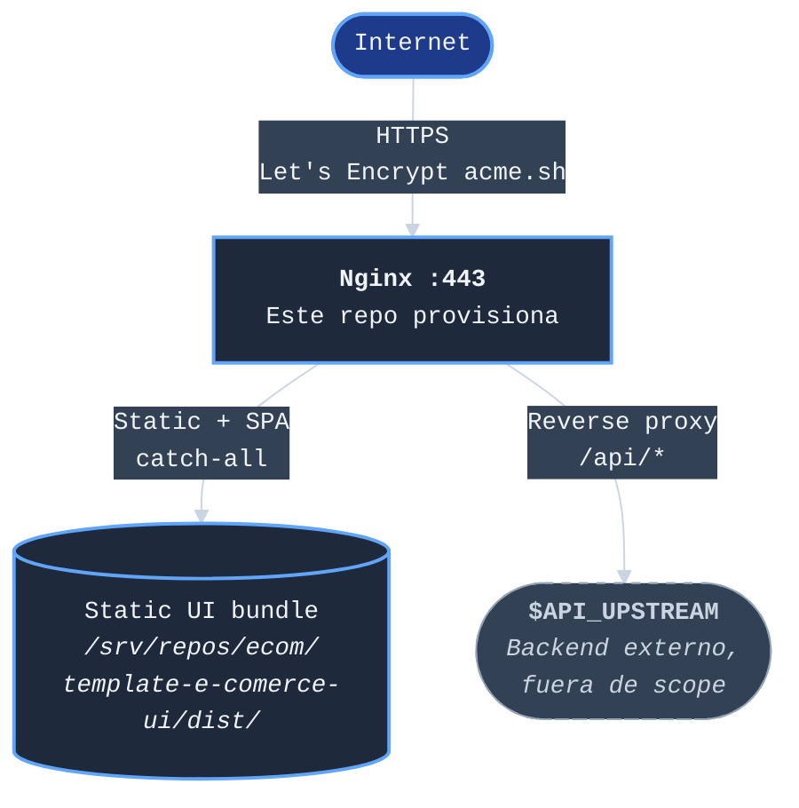
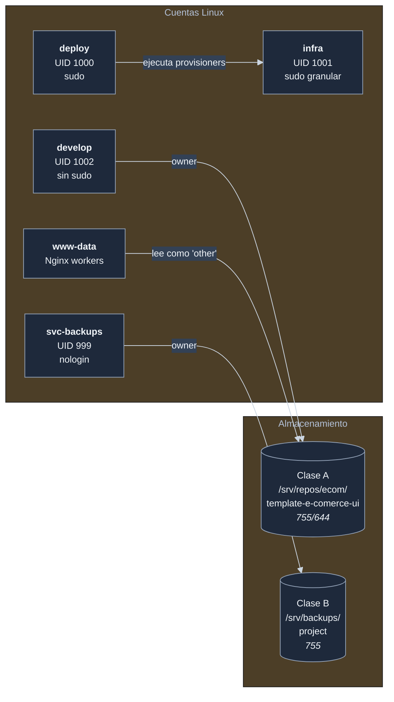
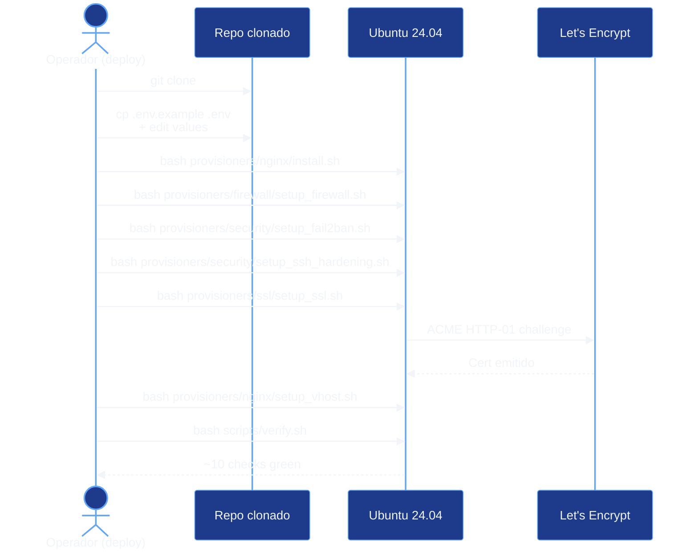
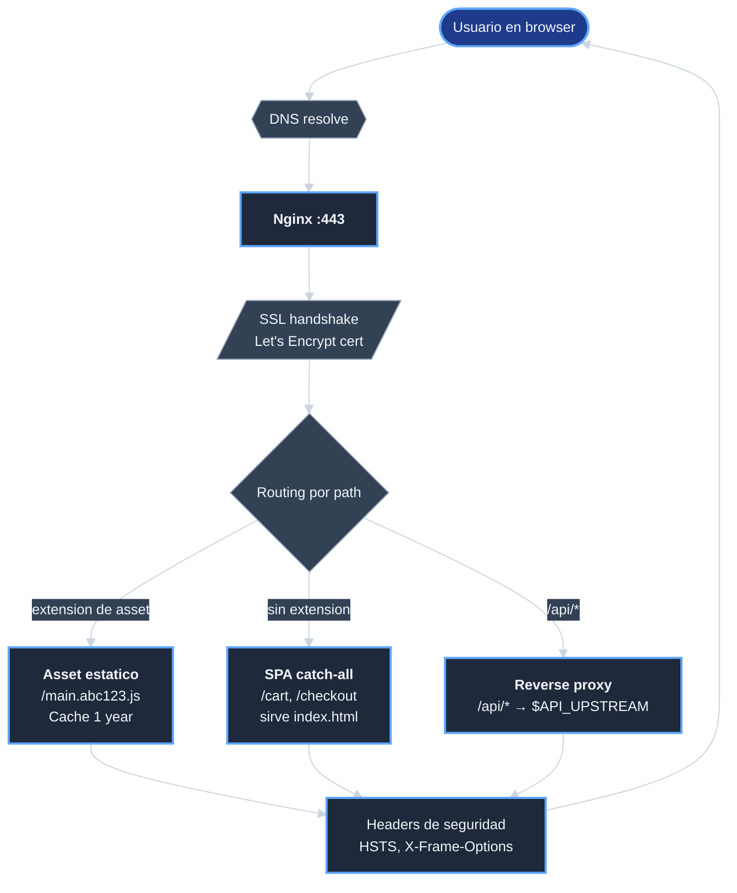
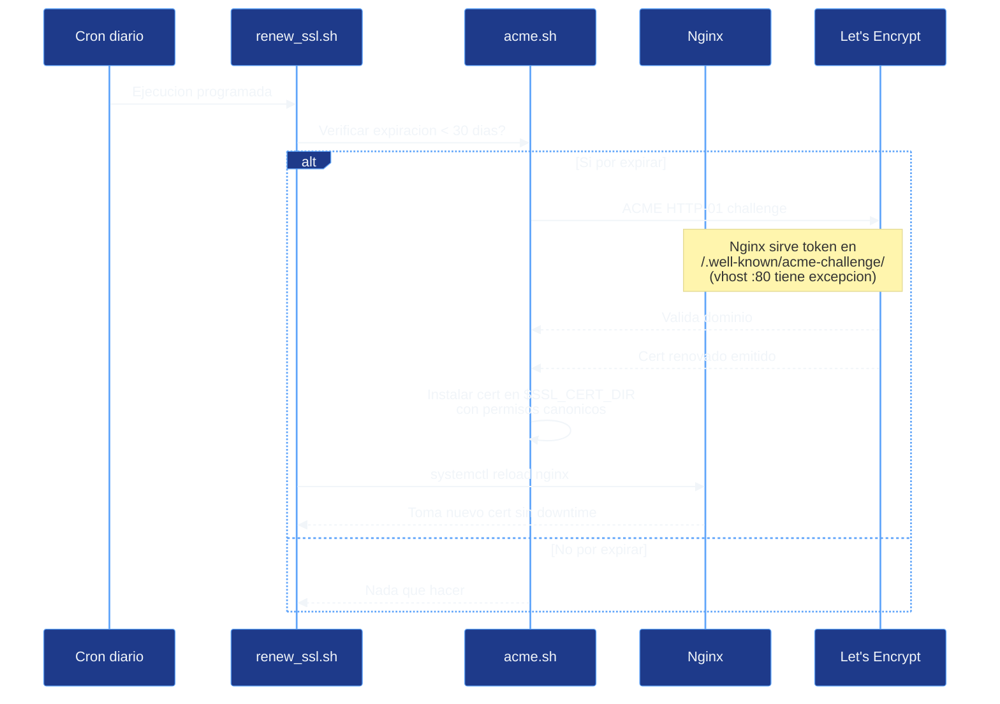

# Arquitectura — `template-ecomerce-ui-server`

| Campo | Valor |
|-------|-------|
| Documento | Arquitectura aprobada del server |
| Estado | Inicial. Refleja las decisiones aprobadas al abrir la iniciativa. |
| Producido en | F0 (apertura de la iniciativa) |
| Fuente principal | Analisis previo en el repo UI (commit `7110527`) — ver [referencias][analisis-ui] |
| Referencia externa | Repo de referencia [`jcg-admin/e-comerce-server`][ref-ecomerce-server] (clonado en `/tmp/references/e-comerce-server/`) |

## Vista de alto nivel

El server es la **capa 1 de una arquitectura 3-tier** que sirve
el template [`template-e-comerce-ui`][repo-ui] en produccion:

**Punto clave**: este server **no asume** que existe un backend
API ni que tecnologia usa. Provee la capa de servir el UI y un
reverse proxy configurable hacia donde la API exista cuando
exista.

## Componentes

### Componente 1: web server

- **Nginx 1.24+** (Ubuntu 24.04 apt repository).
- Funciones:
  - Terminacion SSL (Let's Encrypt en produccion, self-signed en
    desarrollo).
  - Servir static UI bundle desde filesystem.
  - SPA catch-all: cualquier ruta sin extension cae a
    `index.html` para que React Router lo maneje en cliente.
  - Reverse proxy `/api/*` hacia `$API_UPSTREAM`.
  - Cache largo en assets con hash de webpack.
  - Headers HTTP de seguridad (HSTS, X-Frame-Options, etc).
- Configuracion: dos vhosts — uno HTTP `:80` con redirect a HTTPS
  + excepcion ACME, otro HTTPS `:443`. Templates con placeholders
  `%%VAR%%` que se completan al ejecutar `setup_vhost.sh`.

### Componente 2: SSL

- **acme.sh** (no certbot). Gestiona certificados Let's Encrypt
  con cron de renovacion automatica.
- Modo dual:
  - Produccion: dominio publico + DNS apuntando al server.
  - Desarrollo: fallback self-signed si `DOMAIN=localhost`.
- Permisos canonicos:
  - `cert.pem`, `fullchain.pem` con `0644` (publicos).
  - `key.pem` con `0600 root:root` (Nginx master root la lee
    antes de drop-privileges).

### Componente 3: hardening de seguridad

- **fail2ban** con 2 jails activos:
  - `sshd`: bloquea IPs con fallos de autenticacion SSH.
  - `nginx-limit-req` + `nginx-botsearch`: bloquean abusadores.
- **OpenSSH** endurecido: sin password, sin root, puerto no
  estandar configurable.
- **UFW** firewall: deny incoming + allow outgoing + abre solo
  `SSH_PORT` + `80` + `443`.

Detalles concretos en [seguridad][doc-seguridad].

### Componente 4: modelo de cuentas Linux

Cuatro cuentas con separacion estricta de privilegios:

| Cuenta | UID | Funcion | Sudo | Login |
|--------|-----|---------|------|-------|
| `deploy` | 1000 | Operador admin, ejecuta provisioners | Si | Si |
| `infra` | 1001 | Sudo granular NOPASSWD por binario | Granular | Si |
| `develop` | 1002 | Owner del codigo del UI en `/srv/repos/ecom/` | NO | Si |
| `svc-backups` | 999 | Backups del proyecto | NO | nologin |

Cuenta del referente **excluida**: `svc-dbdata` (UID 997) porque
no hay base de datos en scope.

Nginx corre con master `root` que fork-ea workers a `www-data`
(default Ubuntu). Los repos son `develop:develop` con perms
`755/644`, asi `www-data` (que es "other") puede leer.

### Componente 5: clases de almacenamiento

Dos clases (en lugar de las tres del referente):

| Clase | Path | Owner / perms | Contenido |
|-------|------|---------------|-----------|
| A | `/srv/repos/ecom/template-e-comerce-ui` | `develop:develop` 755/644 | Codigo del UI |
| B | `/srv/backups/project` | `svc-backups:svc-backups` 755 | Backups del proyecto |

Clase C del referente (`/srv/backups/database`) **excluida** por
la misma razon que `svc-dbdata`.

## Decisiones arquitectonicas aprobadas

Estas son las **6 decisiones aprobadas al abrir la iniciativa**
(ver [alcance de la iniciativa][doc-alcance]):

| ID | Decision | Resumen |
|----|----------|---------|
| D-WS | Nginx en lugar de Apache | Catch-all SPA en 1 linea, reverse proxy nativo, footprint menor, agnostic a tecnologia backend. Justificacion en el [analisis previo del UI][analisis-ui]. |
| D-CUENTAS | 4 cuentas Linux (sin `svc-dbdata`) | No hay BD en scope. |
| D-STORAGE | 2 clases (A, B) sin C | Idem. |
| D-NOMBRE | `template-ecomerce-ui-server` sin guion entre `e` y `comerce` | Decision explicita del usuario. Asimetria intencional vs [`template-e-comerce-ui`][repo-ui] que tiene guion. |
| D-BACKEND-AGNOSTIC | El server NO asume tecnologia backend | `$API_UPSTREAM` es variable de entorno; vacio por defecto. Si la API no esta, `/api/*` devuelve 502 hasta configurar. |
| D-PROVISIONER-PATTERN | Heredar patron shell idempotente con placeholders `%%VAR%%` del referente | Probado en [`jcg-admin/e-comerce-server`][ref-ecomerce-server], reutilizable. |

ADRs detallados para D-WS, D-CUENTAS, D-STORAGE pendientes en
F0a (validaciones iniciales). Viviran en [`docs/desarrollo/`][doc-desarrollo].

## Flujos importantes

### Flujo 1: aprovisionar el server desde cero

Detalle paso a paso en [operaciones][doc-operaciones] cuando F10
lo produzca.

### Flujo 2: peticion del usuario al sitio en produccion

### Flujo 3: renovacion automatica de SSL

## Lo que el server NO hace

Para evitar ambiguedad:

- **No es un backend API**. Reverse-proxy hacia uno, no
  implementa uno.
- **No gestiona base de datos**. Cero scripts de DB; cero
  `svc-dbdata`.
- **No monitoriza**. Solo `verify.sh` puntual.
- **No despliega**. El operador clona el repo del UI y ejecuta
  `npm run build` manualmente o con su sistema CI/CD; este repo
  no automatiza ese paso.
- **No gestiona DNS**. Asume que el dominio esta apuntando al IP
  del server.
- **No incluye CI/CD propio**. Posible iniciativa futura.

## Diferencias con el referente

Tabla rapida vs [`jcg-admin/e-comerce-server`][ref-ecomerce-server]:

| Aspecto | Referente | Este repo |
|---------|-----------|-----------|
| Web server | Apache 2.4 + mod_wsgi | **Nginx 1.24+** |
| Backend | Django (acoplado) | **Externo, `$API_UPSTREAM`** |
| SPA catch-all | Django `serve_spa` view | **Nginx `try_files /index.html`** |
| Modelo cuentas | 5 | **4** (sin `svc-dbdata`) |
| Storage classes | A, B, C | **A, B** (sin C) |
| fail2ban jails | sshd + apache-auth | **sshd + nginx-*** |
| LOC bash estimadas | ~3500 | **~2800** |

## Referencias

- Decisiones detalladas: [alcance de la iniciativa][doc-alcance].
- Analisis previo que motivo esta arquitectura:
  [analisis-servidor-para-template.md][analisis-ui] (en el repo
  UI, commit `7110527`).
- Repo de referencia: [`jcg-admin/e-comerce-server`][ref-ecomerce-server].
- Procedimiento externo de almacenamiento:
  `Procedimiento-Implementacion-Almacenamiento-WSL2-ecomerce-p001 v1.0.0`.
- Glosario de terminos: [glosario][doc-glosario].

<!-- Referencias Markdown (link references) -->
[doc-alcance]: pm/iniciativas/crear-template-ecomerce-ui-server/alcance-crear-template-ecomerce-ui-server.md
[doc-operaciones]: operaciones.md
[doc-seguridad]: seguridad.md
[doc-desarrollo]: desarrollo/index.md
[doc-glosario]: glosario.md
[analisis-ui]: https://github.com/jcg-admin/template-e-comerce-ui/blob/main/docs/desarrollo/analisis-servidor-para-template.md
[repo-ui]: https://github.com/jcg-admin/template-e-comerce-ui
[ref-ecomerce-server]: https://github.com/jcg-admin/e-comerce-server
