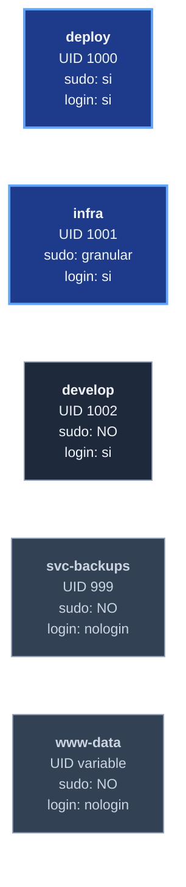

# Glosario — `template-ecomerce-ui-server`

Terminologia usada con frecuencia en este repositorio.
Mantenido alfabeticamente.

| Termino | Significado |
|---------|-------------|
| **ACME** | Automatic Certificate Management Environment. Protocolo IETF ([RFC 8555][rfc-8555]) para gestion automatica de certificados X.509. [Let's Encrypt][lets-encrypt] lo usa. |
| **acme.sh** | Cliente ACME en bash puro. Alternativa a certbot. Usado en este repo por simplicidad y nulas dependencias Python. Repo upstream: <https://github.com/acmesh-official/acme.sh>. |
| **API_UPSTREAM** | Variable de entorno definida en `.env`. Apunta al backend al que Nginx reverse-proxy-eara `/api/*`. Vacio por defecto: el server NO asume tecnologia backend. Ver [arquitectura][doc-arquitectura]. |
| **arc42** | Estandar de documentacion de arquitectura (<https://arc42.org/>). Junto con PROC-GESTION-001 forma la base de la documentacion de este repo. |
| **deploy** | Cuenta Linux UID 1000. Operador admin que ejecuta los provisioners con sudo. |
| **develop** | Cuenta Linux UID 1002. Owner del codigo del UI en `/srv/repos/ecom/`. Sin sudo. |
| **`dist/`** | Output del build de webpack en [`template-e-comerce-ui`][repo-ui]. Producido por `npm run build`. Es lo que Nginx sirve directamente desde filesystem. |
| **fail2ban** | Demonio que monitoriza logs y banea IPs con patrones de abuso. Web: <https://www.fail2ban.org/>. En este repo: jails `sshd` + `nginx-limit-req` + `nginx-botsearch`. |
| **HSTS** | HTTP Strict Transport Security. Header HTTP que instruye al browser a usar SOLO HTTPS por un periodo de tiempo. En este repo: 1 año + includeSubDomains + preload. Ver [seguridad][doc-seguridad]. |
| **HTTP-01 challenge** | Mecanismo de validacion de dominio de ACME. acme.sh pone un token en `/.well-known/acme-challenge/`, Let's Encrypt lo lee, valida control del dominio. |
| **infra** | Cuenta Linux UID 1001. Sudo granular NOPASSWD por binario para tareas de aprovisionamiento. |
| **mod_wsgi** | Modulo Apache que embebe un interprete Python. Usado por el referente para servir Django. **NO usado en este repo**: la justificacion completa de descartarlo esta en [arquitectura][doc-arquitectura]. |
| **Nginx** | Servidor web y reverse proxy. Web: <https://nginx.org/>. **Elegido** sobre Apache para este repo. Justificacion en [arquitectura][doc-arquitectura]. |
| **provisioner** | Script bash idempotente que aprovisiona una parte del servidor. En este repo: `nginx/install.sh`, `nginx/setup_vhost.sh`, `ssl/setup_ssl.sh`, `security/setup_fail2ban.sh`, `security/setup_ssh_hardening.sh`, `firewall/setup_firewall.sh`. |
| **reverse proxy** | Servidor que recibe peticiones del cliente y las reenvia a un backend. Nginx hace reverse proxy de `/api/*` hacia `$API_UPSTREAM`. |
| **rsync** | Herramienta de sincronizacion incremental de archivos. Usada para desplegar el `dist/` del UI al server. Web: <https://rsync.samba.org/>. |
| **self-signed** | Certificado SSL firmado por su propia clave en lugar de una CA reconocida. Usado en desarrollo (`DOMAIN=localhost`). El browser muestra warning; aceptable para dev local. |
| **SPA** | Single-Page Application. Aplicacion JS que maneja routing en cliente (e.g. React Router). Requiere que el server sirva `index.html` para cualquier ruta sin extension de asset. |
| **SPA catch-all** | Configuracion del web server para servir `index.html` ante rutas SPA. En Nginx: `try_files $uri $uri/ /index.html;` (1 linea). En Apache: requiere vista en el backend (e.g. `serve_spa` en Django). |
| **svc-backups** | Cuenta Linux UID 999. Sin login interactivo. Owner de los backups del proyecto en `/srv/backups/project/`. |
| **`template-e-comerce-ui`** | Repositorio del UI React, **con guion** entre `e` y `comerce`. Naming historico. Repo en GitHub: <https://github.com/jcg-admin/template-e-comerce-ui>. |
| **`template-ecomerce-ui-server`** | Este repositorio. **Sin guion** entre `e` y `comerce`. Naming canonico aprobado por el usuario; asimetria intencional vs el repo UI. |
| **UFW** | Uncomplicated Firewall. Frontend amigable de iptables/nftables. Configura la politica de red del server. En este repo: deny incoming + allow outgoing + abre `SSH_PORT`, `80`, `443`. |
| **UI_DIST** | Variable de entorno. Path absoluto donde vive el `dist/` del UI. Default WSL2: `/srv/repos/ecom/template-e-comerce-ui/dist`. |
| **vhost** | Virtual host. Configuracion de Nginx (o Apache) que define como se sirve un dominio en particular. En este repo: dos vhosts, uno HTTP `:80` (redirige a HTTPS) y uno HTTPS `:443` (sirve UI + reverse proxy a API). |
| **WSGI** | Web Server Gateway Interface. Estandar Python ([PEP 3333][pep-3333]) para comunicar web servers con apps Python. Usado por el referente con Django; **NO usado en este repo**. |
| **WSL2** | Windows Subsystem for Linux v2. Permite ejecutar un kernel Linux real en Windows. Soportado por los provisioners de este repo via deteccion del entorno (skip de sshd y UFW segun corresponda). |
| **www-data** | Cuenta Linux estandar de Ubuntu para servicios web. Nginx workers corren bajo esta cuenta tras drop-privileges del master `root`. |
| **X-Forwarded-Proto** | Header HTTP usado por reverse proxies para informar al backend del protocolo original (HTTP vs HTTPS). Sin este header, un backend que detecta protocolo via `request.scheme` puede entrar en bucle de redirects HTTPS. |
| **Yorubá** | Identificador de marca aparecido en el [referente][ref-ecomerce-server] (`PracticaYoruba`). Sin relacion con este repo; solo nota historica. |

## Comparacion rapida de cuentas Linux

## Comparacion rapida de clases de almacenamiento

| Clase | Path | Owner | Perms | Contiene |
|-------|------|-------|-------|----------|
| A | `/srv/repos/ecom/template-e-comerce-ui` | `develop:develop` | `755/644` (world-readable) | Codigo del UI |
| B | `/srv/backups/project` | `svc-backups:svc-backups` | `755` | Backups del proyecto |

## Como contribuir al glosario

Si introduces un termino nuevo en otro doc del repo, anadelo
aqui. Mantener alfabetico. Una linea por termino. Cross-link a
docs detallados cuando aplique.

<!-- Referencias Markdown -->
[doc-arquitectura]: arquitectura.md
[doc-seguridad]: seguridad.md
[repo-ui]: https://github.com/jcg-admin/template-e-comerce-ui
[ref-ecomerce-server]: https://github.com/jcg-admin/e-comerce-server
[rfc-8555]: https://datatracker.ietf.org/doc/html/rfc8555
[lets-encrypt]: https://letsencrypt.org/
[pep-3333]: https://peps.python.org/pep-3333/
