# Manual de operaciones — `template-ecommerce-server`

| Campo | Valor |
|-------|-------|
| Documento | Manual operativo del server: como aprovisionar, mantener y recuperar. |
| Estado | **Completo** (cerrado en F10/T-1001). |
| Audiencia | Operadores del servidor (cuenta `deploy`). |

---

## Indice

1. [Prerequisitos del servidor](#prerequisitos-del-servidor)
2. [Configuracion inicial](#configuracion-inicial-una-vez-por-servidor)
3. [Aprovisionamiento paso a paso](#aprovisionamiento-paso-a-paso)
4. [Despliegue del build del UI](#despliegue-del-build-del-ui)
5. [Operacion continua](#operacion-continua)
6. [Recuperacion de fallos](#recuperacion-de-fallos)
7. [Solucion de problemas](#solucion-de-problemas)
8. [Apendices](#apendices)

---

## Prerequisitos del servidor

**Estado: `[Completo]`**

### Sistema operativo

- **Ubuntu 24.04 LTS** (noble).
- Soporte tambien para **WSL2** simulando produccion (los
  provisioners detectan el entorno y aplican skip donde
  corresponda; ver [upgrade-server-systemless][doc-upgrade]
  para detalles del comportamiento sin systemd).

### Hardware minimo recomendado

| Recurso | Minimo | Recomendado |
|---------|--------|-------------|
| CPU | 1 vCPU | 2 vCPU |
| RAM | 1 GB | 2 GB |
| Disco | 10 GB | 20 GB |
| Red | IPv4 publica | IPv4 + IPv6 |

### Acceso requerido

- Cuenta con `sudo` (por convencion: `deploy`, UID 1000).
- Clave SSH instalada en `~/.ssh/authorized_keys` **antes** de
  ejecutar `setup_ssh_hardening.sh`. Si no, lockout (el script
  tiene un guard de proteccion que aborta si no detecta claves,
  pero conviene anticipar).
- Dominio publico **resolvible** apuntando a la IP del server
  (para SSL real con Let's Encrypt). Para desarrollo,
  `DOMAIN=localhost` produce certs self-signed con OpenSSL.

### Cuentas Linux a crear

Modelo de cuentas (D-CUENTAS, ratificado en
`docs/desarrollo/decision-modelo-cuentas.md`):

| Cuenta | UID | Proposito | Sudo |
|--------|-----|-----------|------|
| `deploy` | 1000 | Operacion general del server | si (general) |
| `infra` | 1001 | Tareas de infra restringidas | si (whitelist NOPASSWD) |
| `develop` | 1002 | Desarrollo local | no |
| `svc-backups` | 999 | Cuenta de servicio para backups | no |

UID 997 reservado conceptualmente para `svc-dbdata` si se anade
BD en el futuro (no aplica al server actual).

---

## Configuracion inicial (una vez por servidor)

**Estado: `[Completo]`**

### Diagrama del flujo completo

```mermaid
%%{init: {'theme':'base', 'themeVariables': {
  'background': '#0f172a',
  'primaryColor': '#1e293b',
  'primaryTextColor': '#f1f5f9',
  'primaryBorderColor': '#94a3b8',
  'lineColor': '#cbd5e1',
  'secondaryColor': '#334155',
  'fontSize': '13px'
}}}%%
flowchart TD
    paso_0_clonar["<b>Paso 0</b><br/>git clone"]
    paso_1_env["<b>Paso 1</b><br/>cp .env.example .env<br/>+ editar valores"]
    paso_2_install_nginx["<b>Paso 2</b><br/>install.sh<br/><i>apt nginx</i>"]
    paso_3_ssh_hardening["<b>Paso 3</b><br/>setup_ssh_hardening.sh<br/><i>antes que firewall</i>"]
    paso_4_firewall_ufw["<b>Paso 4</b><br/>setup_firewall.sh<br/><i>UFW</i>"]
    paso_5_fail2ban["<b>Paso 5</b><br/>setup_fail2ban.sh"]
    paso_6_ssl_acme["<b>Paso 6</b><br/>setup_ssl.sh<br/><i>acme.sh</i>"]
    paso_7_setup_vhost["<b>Paso 7</b><br/>setup_vhost.sh<br/><i>reemplaza %%VAR%%</i>"]
    paso_8_verify_health["<b>Paso 8</b><br/>verify.sh<br/><i>12 checks</i>"]
    server_operativo(["Server operativo"])

    paso_0_clonar --> paso_1_env
    paso_1_env --> paso_2_install_nginx
    paso_2_install_nginx --> paso_3_ssh_hardening
    paso_3_ssh_hardening --> paso_4_firewall_ufw
    paso_4_firewall_ufw --> paso_5_fail2ban
    paso_5_fail2ban --> paso_6_ssl_acme
    paso_6_ssl_acme --> paso_7_setup_vhost
    paso_7_setup_vhost --> paso_8_verify_health
    paso_8_verify_health --> server_operativo

    classDef stepNode fill:#1e293b,stroke:#60a5fa,stroke-width:2px,color:#f1f5f9
    classDef warnNode fill:#7c2d12,stroke:#fb923c,stroke-width:2px,color:#fff7ed
    classDef doneNode fill:#14532d,stroke:#4ade80,stroke-width:2px,color:#f0fdf4

    class paso_0_clonar,paso_1_env,paso_2_install_nginx,paso_4_firewall_ufw,paso_5_fail2ban,paso_6_ssl_acme,paso_7_setup_vhost,paso_8_verify_health stepNode
    class paso_3_ssh_hardening warnNode
    class server_operativo doneNode
```



### Orden critico

El orden de los 8 pasos NO es arbitrario. Razones por dependencia:

1. **install Nginx primero**: los provisioners siguientes asumen
   que `nginx -t` funciona y `/etc/nginx/sites-available/` existe.
2. **ssh_hardening ANTES de firewall**: el hardening define
   `SSH_PORT` efectivo. El firewall debe permitir ese puerto
   ANTES de habilitar UFW, o la sesion SSH se corta (lockout).
3. **firewall ANTES de fail2ban**: el `banaction = ufw` de
   fail2ban requiere que UFW este activo para agregar reglas
   de denegacion.
4. **SSL ANTES de setup_vhost**: el template HTTPS referencia
   `${SSL_CERT_DIR}/cert.pem` que debe existir, o `nginx -t`
   falla y `_revert` borra los symlinks.
5. **verify.sh al final**: requiere que TODO este desplegado.

> **Nota sobre el Paso 3**: el script desactiva la autenticacion
> por contrasena. Verificar **antes** que la clave SSH esta en
> `~/.ssh/authorized_keys` para no quedarse bloqueado.

### Paso 0: clonar el repo

```bash
# Como cuenta deploy:
cd /srv/repos/tui/  # o donde decidas
git clone https://github.com/jcg-admin/template-ecommerce-server.git
cd template-ecommerce-server
```

### Paso 1: crear `.env`

```bash
cp .env.example .env
# Editar .env con los valores reales del servidor.
```

Variables criticas (listado completo en `.env.example`):

- `DOMAIN`: el dominio publico (e.g. `midominio.com`).
- `UI_DIST`: path al build del UI
  (`/srv/repos/tui/template-ecommerce-ui/dist`).
- `API_UPSTREAM`: URL del backend
  (`http://127.0.0.1:8000` para dev local, etc).
  Vacio (`API_UPSTREAM=`): `/api/*` queda comentado en el
  vhost por design (D-BACKEND-AGNOSTIC).
- `SSL_EMAIL`: email para Let's Encrypt.
- `SSL_STAGING`: `true` para usar Let's Encrypt staging
  (cert no confiable pero sin rate-limit).
- `SSH_PORT`: puerto SSH no estandar (default 2222 en
  `.env.example`).

### Paso 2: instalar Nginx

**`[Completo]`**

```bash
sudo bash provisioners/nginx/install.sh
```

Detalle: instala `nginx` via apt, valida version `>= 1.24`,
configura systemd para start at boot, ejecuta `nginx -t`
post-install. Si la version instalada es incorrecta, hace
backup de `/etc/nginx/`, purga 6 variantes (`nginx-core`,
`extras`, `full`, `light`, `common`) y reinstala. Sin systemd
(WSL2/CI), el script aplica `log_manual_start` documentando
arranque manual.

### Paso 3: endurecer SSH

**`[Completo]`**

```bash
sudo bash provisioners/security/setup_ssh_hardening.sh
```

> **ADVERTENCIA**: verifica que tienes clave SSH en
> `~/.ssh/authorized_keys` antes de ejecutar. El script
> desactiva la autenticacion por contrasena. El guard
> `_check_authorized_keys` aborta si no encuentra ninguna
> clave (`ssh-`/`ecdsa-`/`sk-`) en `/root/.ssh/` ni en
> `/home/*/.ssh/`.

Detalle: crea
`/etc/ssh/sshd_config.d/99-template-ecommerce-server.conf`
con `Port $SSH_PORT`, `PermitRootLogin no`,
`PasswordAuthentication no`, `MaxAuthTries 3`,
`LoginGraceTime 30`, `ClientAliveInterval 300`,
`X11Forwarding no`, `AllowTcpForwarding no`. Valida con
`sshd -t` antes de recargar; si falla, revierte el override
para no dejar sshd inconsistente.

### Paso 4: configurar firewall

**`[Completo]`**

```bash
sudo bash provisioners/firewall/setup_firewall.sh
```

> **CRITICO LOCKOUT**: el script aplica `ufw allow $SSH_PORT/tcp`
> **antes** de `ufw --force enable`. Si ya invocaste el paso 3,
> `SSH_PORT` esta correctamente en `.env` y el script lo lee
> automaticamente.

Detalle: politica `deny incoming` + `allow outgoing`. Abre 3
puertos: `$SSH_PORT/tcp`, `80/tcp` (ACME challenge + redirect),
`443/tcp` (aplicacion). Sin nada mas. Habilita UFW con `--force`
para evitar prompt interactivo.

### Paso 5: configurar fail2ban

**`[Completo]`**

```bash
sudo bash provisioners/security/setup_fail2ban.sh
```

Detalle: instala fail2ban, escribe
`/etc/fail2ban/jail.d/template-ecommerce-server.conf` con 3
jails:

- `sshd`: 5 intentos / 600s / ban 3600s. Monitorea
  `/var/log/auth.log`.
- `nginx-limit-req`: 10 / 600s / ban 1800s. Monitorea
  `/var/log/nginx/template-https-error.log` (donde aparecen
  los 503 de rate-limit).
- `nginx-botsearch`: 2 / 600s / ban 86400s (24h). Monitorea
  ambos access logs HTTP + HTTPS. Banea scanners conocidos
  (`/wp-admin/`, `/phpmyadmin/`, `/xmlrpc.php`, `.git`, `.env`).

Todos con `banaction = ufw` (consistente con paso 4).

### Paso 6: obtener certificado SSL

**`[Completo]`**

Tres modos posibles segun el entorno:

**Produccion** (requiere dominio publico + DNS apuntando):

```bash
sudo bash provisioners/ssl/setup_ssl.sh
```

**Staging** (Let's Encrypt staging, valida sin gastar rate-limit
de produccion). Equivalente: setear `SSL_STAGING=true` en `.env`:

```bash
sudo bash provisioners/ssl/setup_ssl.sh --staging
```

**Desarrollo** (self-signed con OpenSSL, sin red ni dominio
publico):

```bash
sudo bash provisioners/ssl/setup_ssl.sh --dev
```

Detalle: idempotente. 3 escenarios manejados:

| `SSL_CERT_STATUS` | Accion |
|-------------------|--------|
| `OK` (cert vigente) | Exit 0 sin cambios |
| `WARN` (proximo a vencer) | Delega a `scripts/renew_ssl.sh` |
| `ERR` (vencido o ausente) | Emite cert nuevo |

En modo produccion/staging instala `acme.sh`, emite el cert
via HTTP-01 challenge en `/var/www/acme-challenge/`, instala
el cert en `$SSL_CERT_DIR/{cert,key,fullchain}.pem`, configura
cron de renovacion automatica con `--reloadcmd 'nginx -s reload'`.
En modo `--dev` genera self-signed con OpenSSL (365 dias).

Permisos canonicos aplicados (D-STORAGE):
`key.pem 0600 root:root`, `cert.pem 0644 root:root`,
`fullchain.pem 0644 root:root`.

### Paso 7: activar los virtualhosts

**`[Completo]`**

```bash
sudo bash provisioners/nginx/setup_vhost.sh
```

Detalle: lee `config/nginx/template-http.conf` y
`template-https.conf`, sustituye los placeholders `%%DOMAIN%%`,
`%%UI_DIST%%`, `%%API_UPSTREAM%%`, `%%SSL_CERT_DIR%%` con los
valores de `.env`. Copia las configs a
`/etc/nginx/sites-available/`, crea symlinks en
`sites-enabled/`, desactiva el default vhost, valida `nginx -t`,
recarga.

Si `nginx -t` falla, `_revert` quita los symlinks y restaura el
default. Si `API_UPSTREAM` esta vacio en `.env`, el bloque
`location /api/` queda comentado completo (sed con range
pattern entre apertura y cierre).

### Paso 8: verificar el entorno

**`[Completo]`**

```bash
bash scripts/verify.sh
```

12 checks. Output verde si todo OK; rojo si hay problemas. Exit
code 0 si `_ERR == 0`, 1 si hay errores.

Checks (listados en `scripts/verify.sh` header):

1. Variables `.env` (6 requeridas + API_UPSTREAM con 3 estados)
2. Nginx instalado >= 1.24
3. Nginx escuchando en `:80`
4. SSL escuchando en `:443`
5. Certificado SSL valido (>= `SSL_CERT_DAYS_ERR` dias)
6. API upstream responde (SKIP si `API_UPSTREAM=`)
7. Redirect HTTP -> HTTPS (301 con Location: `https://...`)
8. SPA catch-all activo (GET a ruta inexistente -> 200)
9. UFW activo con SSH + 80 + 443 permitidos
10. Privilegio minimo: `key.pem` 0600 + workers Nginx no-root
11. fail2ban activo con 3 jails
12. SSH hardening: Port != 22 (warn), `PermitRootLogin no`,
    `PasswordAuthentication no`

---

## Aprovisionamiento paso a paso

**Estado: `[Completo]`**

### Walkthrough completo: VPS Ubuntu 24.04 fresh

Asume que ya tienes:
- VPS Ubuntu 24.04 LTS con acceso SSH como `root` o como un
  usuario con `sudo`.
- Dominio resolviendo a la IP del VPS (e.g. via DNS).
- Build del UI listo en otra maquina o accesible via rsync.

#### 1. Crear cuenta `deploy` y configurar clave SSH

Como root (o con sudo):

```bash
# Crear usuario con UID canonico
sudo useradd -m -u 1000 -s /bin/bash deploy
sudo passwd deploy
sudo usermod -aG sudo deploy

# Crear directorio .ssh
sudo mkdir -p /home/deploy/.ssh
sudo chmod 700 /home/deploy/.ssh

# Anadir tu clave publica
sudo tee /home/deploy/.ssh/authorized_keys << 'KEY'
ssh-ed25519 AAAA... tu_email@dominio.com
KEY
sudo chmod 600 /home/deploy/.ssh/authorized_keys
sudo chown -R deploy:deploy /home/deploy/.ssh
```

#### 2. Reconectarse como `deploy` y clonar el repo

```bash
# Desde tu maquina local
ssh deploy@TU_VPS_IP

# En el VPS
sudo mkdir -p /srv/repos/ecom
sudo chown deploy:deploy /srv/repos/ecom
cd /srv/repos/ecom
git clone https://github.com/jcg-admin/template-ecommerce-server.git
cd template-ecommerce-server
```

#### 3. Configurar `.env`

```bash
cp .env.example .env
nano .env  # o vim/emacs, segun preferencia
```

Editar las variables criticas:

```ini
DOMAIN=mitemplate.com
UI_DIST=/srv/repos/tui/template-ecommerce-ui/dist
API_UPSTREAM=                       # o http://127.0.0.1:8000
SSL_EMAIL=admin@mitemplate.com
SSL_STAGING=false                   # true para LE staging
SSH_PORT=2222                       # cambiar al puerto deseado
```

#### 4. Aprovisionar el servidor con `setup.sh`

**Punto de entrada unificado (recomendado):**

```bash
# Fase 1: Nginx + SSH hardening
sudo bash scripts/setup.sh

# El script pausa con instrucciones de reconexion.
# Reconectar en el nuevo puerto:
#   ssh -p 2222 deploy@VPS

# Fase 2: firewall + fail2ban + SSL + vhosts + verify
sudo bash scripts/setup.sh --continue
```

Para SSL staging (valida el flujo ACME sin gastar rate-limit):

```bash
sudo bash scripts/setup.sh --continue --ssl-staging
```

Para entornos sin sshd (WSL2, CI):

```bash
sudo bash scripts/setup.sh --skip-ssh --ssl-dev
```

Ver todos los flags: `bash scripts/setup.sh --help`

**Alternativa — ejecucion manual paso a paso:**

```bash
sudo bash provisioners/nginx/install.sh
sudo bash provisioners/security/setup_ssh_hardening.sh
# Reconectar con el nuevo puerto: ssh -p 2222 deploy@VPS
sudo bash provisioners/firewall/setup_firewall.sh
sudo bash provisioners/security/setup_fail2ban.sh
sudo bash provisioners/ssl/setup_ssl.sh           # produccion
sudo bash provisioners/nginx/setup_vhost.sh
bash scripts/verify.sh
```

Salida esperada de `verify.sh` (resumen):

```
OK:           24
Advertencias: 0
Errores:      0

Entorno listo para produccion.
```

#### 5. Desplegar el UI

Ver [Despliegue del build del UI](#despliegue-del-build-del-ui).

---

## Despliegue del build del UI

**Estado: `[Completo]`**

Como producir el `dist/` del template UI y dejarlo accesible
para que Nginx lo sirva.

### Resumen del flujo

```mermaid
%%{init: {'theme':'base', 'themeVariables': {
  'background': '#0f172a',
  'primaryColor': '#1e293b',
  'primaryTextColor': '#f1f5f9',
  'primaryBorderColor': '#94a3b8',
  'lineColor': '#cbd5e1',
  'secondaryColor': '#334155',
  'fontSize': '13px'
}}}%%
flowchart LR
    maquina_desarrollo["<b>Maquina dev / CI</b><br/>template-ecommerce-ui"]
    paso_npm_build["<i>npm install</i><br/><i>npm run build</i>"]
    directorio_dist[("dist/<br/>chunks + index.html")]
    paso_rsync["<i>rsync -av</i>"]
    directorio_destino_server[("<b>$UI_DIST</b><br/>en el server")]
    servidor_nginx_runtime["<b>Nginx</b><br/>sirve en tiempo real"]

    maquina_desarrollo --> paso_npm_build
    paso_npm_build --> directorio_dist
    directorio_dist --> paso_rsync
    paso_rsync --> directorio_destino_server
    directorio_destino_server --> servidor_nginx_runtime

    classDef devNode fill:#1e293b,stroke:#60a5fa,stroke-width:2px,color:#f1f5f9
    classDef opNode fill:#334155,stroke:#94a3b8,stroke-width:1px,color:#f1f5f9
    classDef prodNode fill:#14532d,stroke:#4ade80,stroke-width:2px,color:#f0fdf4

    class maquina_desarrollo,paso_npm_build,directorio_dist devNode
    class paso_rsync opNode
    class directorio_destino_server,servidor_nginx_runtime prodNode
```



### Procedimiento

#### En la maquina de desarrollo / CI

```bash
git clone https://github.com/jcg-admin/template-ecommerce-ui.git
cd template-ecommerce-ui
npm install
npm run build
ls dist/   # verificar que existe index.html + assets/
```

#### Sincronizar al server

```bash
rsync -avz --delete dist/ deploy@SERVER:/srv/repos/tui/template-ecommerce-ui/dist/
```

Opciones criticas:
- `--delete`: elimina archivos en destino que no esten en
  origen (importante para que builds nuevos no dejen chunks
  viejos rotos).
- `-avz`: archive + verbose + compress.

#### En el server

```bash
# Verificar que Nginx ve los archivos
ls -la /srv/repos/tui/template-ecommerce-ui/dist/
# Forzar test del SPA catch-all
curl -k https://$DOMAIN/cualquier-ruta-inexistente
# Debe retornar HTTP 200 con el index.html del bundle
```

**No es necesario reiniciar Nginx** -- sirve los archivos del
filesystem en tiempo real. El navegador del usuario hara fetch
de los chunks nuevos automaticamente (cache busting via hash
en el nombre del chunk si el bundler lo configuro asi).

### Variantes de despliegue

| Estrategia | Pro | Contra |
|------------|-----|--------|
| `rsync --delete` directo | Simple, atomico file-by-file | Ventana de inconsistencia durante el rsync |
| `rsync` + symlink swap | Atomico a nivel de directorio | Mas complejo |
| CI/CD pipeline | Repetible, auditable | Requiere infra adicional |

Para el repo de referencia, `rsync` directo es suficiente
porque los builds Vite usan hashes en chunks (cache busting).

---

## Operacion continua

**Estado: `[Completo]`**

### Renovacion SSL automatica

`scripts/renew_ssl.sh` se ejecuta via cron semanal; `acme.sh`
internamente solo renueva si el cert tiene < 30 dias de validez.

```bash
# Cron sugerido (ejecutar como root):
0 2 * * 1 /bin/bash /srv/repos/tui/template-ecommerce-server/scripts/renew_ssl.sh
```

El reload de Nginx ocurre automaticamente via el `--reloadcmd
'nginx -s reload'` configurado en `setup_ssl.sh` durante el
paso 6. NO hay que invocar reload manualmente despues.

Log: `${PROJECT_ROOT}/logs/renew_ssl.log`.

### Logs operacionales

| Log | Path | Rotacion |
|-----|------|----------|
| Nginx HTTP access | `/var/log/nginx/template-http-access.log` | logrotate Ubuntu |
| Nginx HTTPS access | `/var/log/nginx/template-https-access.log` | logrotate Ubuntu |
| Nginx HTTPS error | `/var/log/nginx/template-https-error.log` | logrotate Ubuntu |
| fail2ban | `/var/log/fail2ban.log` | logrotate Ubuntu |
| SSH | `/var/log/auth.log` | logrotate Ubuntu |
| acme.sh | `~deploy/.acme.sh/acme.sh.log` | acme.sh lo maneja |
| renew_ssl | `${PROJECT_ROOT}/logs/renew_ssl.log` | manual (rm si crece) |

### Comandos de inspeccion diaria

```bash
# Estado general
sudo systemctl status nginx fail2ban
sudo ufw status verbose
sudo fail2ban-client status

# Logs en vivo
sudo tail -f /var/log/nginx/template-https-error.log
sudo tail -f /var/log/fail2ban.log

# Verificar entorno
bash scripts/verify.sh
```

### Verificacion programada

`verify.sh` puede ejecutarse desde cron para alertar:

```bash
# Cron cada hora; envia email si exit != 0
0 * * * * bash /srv/.../scripts/verify.sh > /tmp/verify.out 2>&1 || mail -s "verify.sh FAIL" admin@dom < /tmp/verify.out
```

### Backup canonico

`backups/` en el repo es el destino convencional. No se versiona
contenido sensible. Items que conviene respaldar periodicamente:

- `/etc/nginx/sites-available/template-*.conf` (configs activas)
- `${SSL_CERT_DIR}/` (cert + key + fullchain)
- `${PROJECT_ROOT}/.env` (config del servidor)
- `/etc/ssh/sshd_config.d/99-template-ecommerce-server.conf`
- `/etc/fail2ban/jail.d/template-ecommerce-server.conf`

---

## Recuperacion de fallos

**Estado: `[Completo]`**

### Nginx no levanta tras reboot

Diagnostico:
```bash
sudo systemctl status nginx
sudo nginx -t
sudo journalctl -u nginx --since "10 min ago"
```

Causas frecuentes:
- Cert SSL expiro y no renovo. Solucion: ejecutar
  `bash scripts/renew_ssl.sh` o reemitir con `setup_ssl.sh`.
- Config corrupta tras edicion manual. Solucion: re-ejecutar
  `setup_vhost.sh` que regenera desde templates.
- Puerto ocupado por otro proceso. Solucion: `sudo lsof -i :80`
  y matar el proceso conflictivo.

### Certificado SSL no se renueva

Diagnostico:
```bash
cat /srv/repos/tui/template-ecommerce-server/logs/renew_ssl.log
~/.acme.sh/acme.sh --info -d $DOMAIN
```

Causas frecuentes:
- Cron no se instalo. Solucion: re-ejecutar `setup_ssl.sh`
  (configura el cronjob automaticamente via
  `acme.sh --install-cronjob`).
- ACME challenge falla porque `/var/www/acme-challenge/` no es
  servido por Nginx. Solucion: re-ejecutar `setup_vhost.sh`
  (el template HTTP tiene el bloque
  `location /.well-known/acme-challenge/`).
- DNS apunta a otra IP. Solucion: verificar `dig $DOMAIN` =
  IP del server.

### fail2ban banea legitimamente al operador

Si te baneas a ti mismo intentando entrar por SSH:

```bash
# Desde otra IP (movil tethering, otro server, etc):
ssh -p 2222 deploy@SERVER
sudo fail2ban-client set sshd unbanip TU_IP_QUE_FUE_BANEADA
```

Si no tienes otra IP disponible: acceder al server por consola
del proveedor (DigitalOcean console, AWS Session Manager, etc).

### Espacio de disco lleno

```bash
df -h
du -sh /var/log/* | sort -h | tail
sudo journalctl --vacuum-size=100M
sudo apt-get clean
```

Logs que crecen tipicamente: `/var/log/nginx/*.log`,
`/var/log/auth.log` (especialmente con fail2ban activo).
logrotate los rota pero si el server tiene poco espacio,
considera reducir `rotate` en `/etc/logrotate.d/nginx`.

### Configuracion corrupta detectada por nginx -t

Si `setup_vhost.sh` detecta `nginx -t` fallido, ejecuta
`_revert` automaticamente. Si te quedaste con configs
corruptas por edicion manual:

```bash
# Restaurar desde el backup automatico de install.sh
ls /srv/.../backups/
sudo tar -xzf /srv/.../backups/nginx-*.tar.gz -C /tmp/nginx-restore/
sudo cp -r /tmp/nginx-restore/etc/nginx/* /etc/nginx/
sudo nginx -t && sudo systemctl reload nginx
```

### Upgrade fallido de paquetes

```bash
sudo apt-get install -f
sudo dpkg --configure -a
sudo apt-get autoremove
```

Si `nginx` queda en estado broken:
```bash
sudo apt-get purge nginx nginx-core nginx-common nginx-extras nginx-full nginx-light
sudo bash provisioners/nginx/install.sh
sudo bash provisioners/nginx/setup_vhost.sh
```

### Compromiso de seguridad (incident response basico)

1. **Aislar**: `sudo ufw default deny outgoing` (desconecta el
   server de internet excepto lo que tu permitas explicitamente).
2. **Capturar evidencia**:
   ```bash
   sudo journalctl --since "1 hour ago" > /tmp/journal-incident.log
   sudo tail -n 10000 /var/log/auth.log > /tmp/auth-incident.log
   sudo netstat -tnp > /tmp/connections-incident.log
   sudo ps auxf > /tmp/processes-incident.log
   ```
3. **Rotar credenciales**: cambiar contrasena de `deploy`,
   reemitir cert SSL, regenerar claves SSH.
4. **Reinstalar desde cero** si la causa raiz no se identifica
   (snapshot del VPS + re-aprovisionar).

---

## Solucion de problemas

**Estado: `[Completo]`**

### FAQ operativo

**P: `verify.sh` reporta `Workers Nginx corriendo como root --
riesgo de seguridad`.**

R: Verifica `/etc/nginx/nginx.conf`:
```bash
grep "^user " /etc/nginx/nginx.conf
# Debe ser: user www-data;
```
Si dice `user root;` o esta vacio, edita y reload:
```bash
sudo sed -i 's/^user .*/user www-data;/' /etc/nginx/nginx.conf
sudo nginx -s reload
```

**P: `setup_vhost.sh` falla con "Template no encontrado".**

R: Verifica que estes en el directorio correcto del repo:
```bash
ls config/nginx/template-*.conf
# Debe listar template-http.conf + template-https.conf
```
Si no, `cd` al PROJECT_ROOT o re-clona.

**P: SSL falla con "DOMAIN no resuelve".**

R: Verifica DNS:
```bash
dig $DOMAIN +short
# Debe retornar la IP de tu server
```
Si no, configura el DNS en tu registrar y espera propagacion
(hasta 24h en casos extremos). Mientras tanto, usa
`SSL_STAGING=true` o `--dev`.

**P: `setup_ssh_hardening.sh` aborta con "No se encontro
ninguna clave SSH autorizada".**

R: El guard antilockout funciona. Anade tu clave:
```bash
mkdir -p ~/.ssh
chmod 700 ~/.ssh
echo "ssh-ed25519 AAAA..." >> ~/.ssh/authorized_keys
chmod 600 ~/.ssh/authorized_keys
```
Y re-ejecuta el script.

**P: Tras ejecutar `setup_firewall.sh` perdi la conexion SSH.**

R: Si tienes acceso por consola del proveedor: verifica que
el puerto SSH activo coincide con el permitido en UFW:
```bash
sudo sshd -T | grep "^port "
sudo ufw status | grep -E "^[0-9]+/tcp"
```
Si difieren, ajustar:
```bash
sudo ufw allow PUERTO_SSH_REAL/tcp
```

**P: API_UPSTREAM esta seteado pero `verify.sh` reporta 502.**

R: El backend no responde:
```bash
curl -v $API_UPSTREAM
# Si curl falla -> el backend no esta activo
# Si curl OK pero verify.sh falla -> Nginx no puede alcanzar
#   el upstream (firewall interno, permisos, etc)
sudo tail -f /var/log/nginx/template-https-error.log
```

**P: Quiero cambiar `SSH_PORT` despues del aprovisionamiento.**

R: 3 pasos atomicos:
```bash
# 1. Editar .env con el nuevo SSH_PORT
nano .env

# 2. Reaplicar hardening + firewall (ambos releen .env)
sudo bash provisioners/security/setup_ssh_hardening.sh
sudo bash provisioners/firewall/setup_firewall.sh

# 3. Reconectar con el nuevo puerto
ssh -p NUEVO_PUERTO deploy@SERVER
```

UFW ahora tiene el puerto viejo Y el nuevo. Si quieres limpiar:
```bash
sudo ufw delete allow PUERTO_VIEJO/tcp
```

---

## Apendices

**Estado: `[Completo]`**

### A. Variables de `.env` con descripcion exhaustiva

| Variable | Default | Descripcion |
|----------|---------|-------------|
| `DOMAIN` | (sin default) | Dominio publico del server. Obligatorio. |
| `UI_DIST` | (sin default) | Path absoluto al `dist/` del UI. |
| `API_UPSTREAM` | vacio | URL del backend; vacio = `/api/` comentado. |
| `SSL_EMAIL` | (sin default) | Email para Let's Encrypt notifications. |
| `SSL_CERT_DIR` | `/etc/ssl/template-ecommerce-server` | Donde vive el cert. |
| `SSL_CERT_DAYS_WARN` | 30 | Umbral WARN para `validate_ssl_cert`. |
| `SSL_CERT_DAYS_ERR` | 7 | Umbral ERR. |
| `SSL_STAGING` | false | true para Let's Encrypt staging. |
| `SSH_PORT` | 2222 | Puerto no estandar. |
| `F2B_SSH_MAXRETRY` | 5 | Intentos antes de ban sshd. |
| `F2B_SSH_FINDTIME` | 600 | Ventana de medicion (segundos). |
| `F2B_SSH_BANTIME` | 3600 | Duracion del ban (segundos). |
| `F2B_NGINX_LIMIT_REQ_MAXRETRY` | 10 | Equivalente para 503 rate-limit. |
| `F2B_NGINX_LIMIT_REQ_FINDTIME` | 600 | |
| `F2B_NGINX_LIMIT_REQ_BANTIME` | 1800 | 30 min. |
| `F2B_NGINX_BOTSEARCH_MAXRETRY` | 2 | Bots conocidos. |
| `F2B_NGINX_BOTSEARCH_FINDTIME` | 600 | |
| `F2B_NGINX_BOTSEARCH_BANTIME` | 86400 | 24h (reincidentes). |
| `NGINX_WORKER_PROCESSES` | auto | Default Ubuntu, usar `auto`. |
| `NGINX_WORKER_CONNECTIONS` | 1024 | Default Ubuntu. |

### B. Comandos `nginx` mas usados

```bash
sudo nginx -t                 # Validar config
sudo nginx -s reload          # Reload graceful
sudo nginx -s quit            # Stop graceful
sudo nginx -s reopen          # Reabrir logs (post-rotation)
sudo nginx -V                 # Modulos compilados
sudo systemctl status nginx
sudo journalctl -u nginx --since "1h"
```

### C. Comandos `fail2ban-client` mas usados

```bash
sudo fail2ban-client status                   # Vista general
sudo fail2ban-client status sshd              # Detalle de una jail
sudo fail2ban-client status nginx-limit-req
sudo fail2ban-client status nginx-botsearch
sudo fail2ban-client set <jail> unbanip <IP>  # Desbanear
sudo fail2ban-client banip <IP>               # Ban manual
sudo fail2ban-client -d                       # Validar config
```

### D. Comandos `ufw` mas usados

```bash
sudo ufw status verbose          # Estado + reglas + politicas
sudo ufw allow PORT/tcp
sudo ufw delete allow PORT/tcp
sudo ufw default deny incoming
sudo ufw --force reset           # Reset COMPLETO (cuidado!)
sudo ufw --force enable
sudo ufw --force disable
```

### E. Comandos `acme.sh` mas usados

```bash
~/.acme.sh/acme.sh --info -d $DOMAIN
~/.acme.sh/acme.sh --renew -d $DOMAIN
~/.acme.sh/acme.sh --remove -d $DOMAIN
~/.acme.sh/acme.sh --install-cronjob
~/.acme.sh/acme.sh --upgrade
```

### F. Mapeo de UIDs y permisos canonicos

Cuentas:
- `root` (0)        -- propietario de cert + key + sshd_config
- `deploy` (1000)   -- operador general; sudo
- `infra` (1001)    -- whitelist sudo NOPASSWD para tareas infra
- `develop` (1002)  -- dev local; sin sudo
- `svc-backups` (999) -- cuenta de servicio backups
- `www-data` (33)   -- Nginx workers; readonly sobre UI_DIST

Permisos canonicos D-STORAGE:

| Path | Mode | Owner |
|------|------|-------|
| `$SSL_CERT_DIR/key.pem` | 0600 | root:root |
| `$SSL_CERT_DIR/cert.pem` | 0644 | root:root |
| `$SSL_CERT_DIR/fullchain.pem` | 0644 | root:root |
| `$SSL_CERT_DIR/` (dir) | 0755 | root:root |
| `$UI_DIST/` | 0755 | deploy:www-data |
| `/var/www/acme-challenge/` | 0755 | root:root |
| `~/.ssh/authorized_keys` | 0600 | usuario:usuario |
| `/etc/ssh/sshd_config.d/99-*.conf` | 0644 | root:root |

### G. Procedimiento de rollback completo

Para revertir el servidor al estado pre-aprovisionamiento:

```bash
# 1. Desactivar fail2ban + UFW
sudo systemctl stop fail2ban
sudo ufw --force disable

# 2. Restaurar sshd al default
sudo rm /etc/ssh/sshd_config.d/99-template-ecommerce-server.conf
sudo systemctl reload sshd     # ahora vuelve a aceptar passwords

# 3. Deshacer configs Nginx
sudo rm /etc/nginx/sites-enabled/template-*.conf
sudo rm /etc/nginx/sites-available/template-*.conf
sudo ln -sf /etc/nginx/sites-available/default /etc/nginx/sites-enabled/default
sudo nginx -t && sudo systemctl reload nginx

# 4. Eliminar acme.sh y certs (opcional)
~/.acme.sh/acme.sh --uninstall
sudo rm -rf /etc/ssl/template-ecommerce-server

# 5. Purgar paquetes (opcional, destructivo)
sudo apt-get purge nginx fail2ban ufw
```

> **Backup primero**: el `install.sh` Nginx hace tar.gz de
> `/etc/nginx/` antes de purgar. Usalo para restaurar la config
> exacta que tenia el server antes de cualquier paso.

---

<!-- Referencias Markdown -->
[doc-arquitectura]: arquitectura.md
[doc-upgrade]: upgrade-server-systemless.md
[arq-flujo-3]: arquitectura.md#flujo-3-renovacion-automatica-de-ssl
[tarea-T-1001]: pm/iniciativas/crear-template-ecomerce-ui-server/tareas-crear-template-ecomerce-ui-server.md
[repo-ui]: https://github.com/jcg-admin/template-ecommerce-ui
[ref-ecomerce-server]: https://github.com/jcg-admin/e-comerce-server
