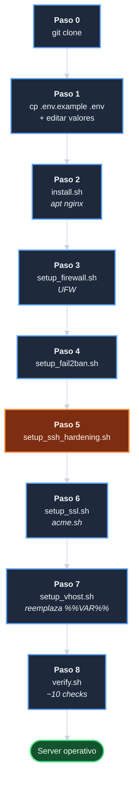

# Manual de operaciones — `template-ecomerce-ui-server`

| Campo | Valor |
|-------|-------|
| Documento | Manual operativo del server: como aprovisionar, mantener y recuperar. |
| Estado | **Esqueleto**. El contenido sustantivo se produce en F10 ([tareas T-1001][tarea-T-1001]). |
| Audiencia | Operadores del servidor (cuenta `deploy`). |

---

## Estado de este documento

Este es el **esqueleto** del manual operativo. Cada seccion
declarada abajo se ira llenando conforme las fases F1..F9
produzcan los provisioners y scripts a documentar.

> **No usar este documento en operacion real hasta que F10 lo
> cierre.** Hasta entonces, las secciones marcadas
> `Pendiente F<n>` no tienen contenido autoritativo.

Marcadores de estado por seccion:

- **`[Pendiente F<n>]`**: la seccion se llena cuando la fase
  `F<n>` produce su entregable.
- **`[Inicial]`**: contenido provisional que sera revisado al
  cerrar F10.
- **`[Completo]`**: seccion final, lista para operacion real.

---

## Indice planificado

1. [Prerequisitos del servidor](#prerequisitos-del-servidor)
2. [Configuracion inicial](#configuracion-inicial-una-vez-por-servidor)
3. [Aprovisionamiento paso a paso](#aprovisionamiento-paso-a-paso)
4. [Despliegue del build del UI](#despliegue-del-build-del-ui)
5. [Operacion continua](#operacion-continua)
6. [Recuperacion de fallos](#recuperacion-de-fallos)
7. [Solucion de problemas](#solucion-de-problemas)
8. [Apendices](#apendices)

---

## Prerequisitos del servidor

**Estado: `[Inicial]`**

### Sistema operativo

- **Ubuntu 24.04 LTS** (jammy o noble).
- Soporte tambien para **WSL2** simulando produccion (los
  provisioners detectan el entorno y aplican skip donde
  corresponda; ver [upgrade-server-systemless][doc-upgrade]
  cuando F10 lo produzca).

### Hardware minimo recomendado

| Recurso | Minimo | Recomendado |
|---------|--------|-------------|
| CPU | 1 vCPU | 2 vCPU |
| RAM | 1 GB | 2 GB |
| Disco | 10 GB | 20 GB |
| Red | IPv4 publica | IPv4 + IPv6 |

### Acceso requerido

- Cuenta con `sudo` (por convencion: `deploy`, UID 1000).
- Clave SSH instalada en `~/.ssh/authorized_keys` **antes** de
  ejecutar `setup_ssh_hardening.sh`. Si no, lockout.
- Dominio publico **resolvible** apuntando a la IP del server
  (para SSL real). Para desarrollo, `DOMAIN=localhost`
  produce certs self-signed.

---

## Configuracion inicial (una vez por servidor)

**Estado: `[Pendiente F4..F8]`**

### Diagrama del flujo completo



> **Nota sobre el Paso 5**: el script desactiva la autenticacion
> por contraseña. Verificar **antes** que la clave SSH esta en
> `~/.ssh/authorized_keys` para no quedarse bloqueado.

### Paso 0: clonar el repo

```bash
# Como cuenta deploy:
cd /srv/repos/ecom/  # o donde decidas
git clone https://github.com/jcg-admin/template-ecomerce-ui-server.git
cd template-ecomerce-ui-server
```

### Paso 1: crear `.env`

```bash
cp .env.example .env
# Editar .env con los valores reales del servidor.
```

Variables criticas:

- `DOMAIN`: el dominio publico (e.g. `midominio.com`).
- `UI_DIST`: path al build del UI
  (`/srv/repos/ecom/template-e-comerce-ui/dist`).
- `API_UPSTREAM`: URL del backend
  (`http://127.0.0.1:8000` para dev local, etc).
  Vacio: `/api/*` devuelve 502 hasta que se configure.
- `SSL_EMAIL`: email para Let's Encrypt.
- `SSH_PORT`: puerto SSH no estandar (default 2222).

Listado completo en `.env.example`.

### Paso 2: instalar Nginx

**`[Pendiente F4]`**

```bash
sudo bash provisioners/nginx/install.sh
```

Detalle: instala `nginx` via apt, valida version >=1.24,
configura systemd para start at boot, verifica que escucha en
`:80`.

### Paso 3: configurar firewall

**`[Pendiente F7]`**

```bash
sudo bash provisioners/firewall/setup_firewall.sh
```

> **ADVERTENCIA**: el script permite SSH **antes** de activar
> UFW para evitar lockout. Si usas un puerto SSH no estandar:
> `SSH_PORT=2222 sudo bash ...`.

Detalle: UFW deny incoming + allow outgoing + abre `SSH_PORT` +
`80` + `443`. Si se ejecuta en WSL2 (sin nftables), skip
explicito.

### Paso 4: configurar fail2ban

**`[Pendiente F6]`**

```bash
sudo bash provisioners/security/setup_fail2ban.sh
```

Detalle: configura jails `sshd` + `nginx-limit-req` +
`nginx-botsearch` con los parametros de `.env` (`F2B_*`).

### Paso 5: endurecer SSH

**`[Pendiente F6]`**

```bash
sudo bash provisioners/security/setup_ssh_hardening.sh
```

> **ADVERTENCIA**: verifica que tienes clave SSH en
> `~/.ssh/authorized_keys` antes de ejecutar. El script
> desactiva la autenticacion por contraseña.

Detalle: cambia puerto SSH a `$SSH_PORT`, desactiva password,
desactiva root login, otras hardenings estandar.

### Paso 6: obtener certificado SSL

**`[Pendiente F5]`**

Tres modos posibles segun el entorno:

**Produccion** (requiere dominio publico + DNS apuntando):

```bash
sudo bash provisioners/ssl/setup_ssl.sh
```

**Staging** (Let's Encrypt staging, valida sin gastar rate-limit
de produccion):

```bash
sudo SSL_STAGING=true bash provisioners/ssl/setup_ssl.sh
```

**Desarrollo** (self-signed, sin dominio real):

```bash
sudo DOMAIN=localhost bash provisioners/ssl/setup_ssl.sh
```

### Paso 7: activar los virtualhosts

**`[Pendiente F4]`**

```bash
sudo bash provisioners/nginx/setup_vhost.sh
```

Detalle: reemplaza los placeholders `%%VAR%%` en
`config/nginx/template-*.conf` con los valores de `.env`, copia
las configs a `/etc/nginx/sites-available/`, crea symlinks en
`sites-enabled/`, valida `nginx -t`, recarga.

### Paso 8: verificar el entorno

**`[Pendiente F8]`**

```bash
bash scripts/verify.sh
```

Detalle: ~10 checks de salud. Output verde si todo OK; rojo si
hay problemas. Detalle de checks individuales en F8.

---

## Aprovisionamiento paso a paso

**Estado: `[Pendiente F10]`**

Walkthrough completo desde un Ubuntu fresh hasta server
operativo, con ejemplos reales de salida esperada.

---

## Despliegue del build del UI

**Estado: `[Pendiente F11]`**

Como producir el `dist/` del template UI y dejarlo accesible
para que Nginx lo sirva.

### Resumen del flujo previsto


1. En la maquina de desarrollo (o CI), clonar
   [`template-e-comerce-ui`][repo-ui].
2. Ejecutar `npm install` + `npm run build`.
3. Sincronizar el `dist/` al server:
   `rsync -av dist/ deploy@server:$UI_DIST/`.
4. **No reiniciar Nginx**: sirve los archivos en tiempo real.

Detalle completo en F11.

---

## Operacion continua

**Estado: `[Pendiente F8, F10]`**

### Renovacion SSL automatica

`scripts/renew_ssl.sh` se ejecuta via cron diario; renueva
certs con menos de 30 dias de validez. Diagrama del flujo en
[arquitectura, Flujo 3][arq-flujo-3].

### Logs

| Log | Path | Rotacion |
|-----|------|----------|
| Nginx access | `/var/log/nginx/template-https-access.log` | logrotate (default Ubuntu) |
| Nginx error | `/var/log/nginx/template-https-error.log` | logrotate |
| fail2ban | `/var/log/fail2ban.log` | logrotate |
| SSH | `/var/log/auth.log` | logrotate |
| acme.sh | `~deploy/.acme.sh/acme.sh.log` | acme.sh lo maneja |

Detalle de uso practico en F10.

### Verificacion de salud

`bash scripts/verify.sh` ejecutable bajo demanda o desde cron.

---

## Recuperacion de fallos

**Estado: `[Pendiente F10]`**

Escenarios y procedimientos para:

- Nginx no levanta tras reboot.
- Certificado SSL no se renueva.
- fail2ban banea legitimamente al operador.
- Espacio de disco lleno.
- Configuracion corrupta en `nginx -t`.
- Upgrade fallido de paquetes.
- Compromiso de seguridad (incident response basico).

---

## Solucion de problemas

**Estado: `[Pendiente F10]`**

FAQ operativo. Errores comunes con causa y resolucion.

---

## Apendices

**Estado: `[Pendiente F10]`**

- Variables de `.env` con descripcion exhaustiva.
- Comandos `nginx` mas usados.
- Comandos `fail2ban-client` mas usados.
- Comandos `ufw` mas usados.
- Comandos `acme.sh` mas usados.
- Mapeo de UIDs y permisos canonicos.
- Procedimiento de rollback completo.

---

## Notas para el operador hasta que F10 cierre

Hasta que este manual este completo (estimado F10, ~3 fases
despues de la actual), el operador debe:

1. Leer [arquitectura][doc-arquitectura] para entender el
   diseño.
2. Consultar los provisioners directamente (`bash -x ...`) si
   necesita entender que hace cada uno.
3. Consultar el README del repo de referencia
   [`jcg-admin/e-comerce-server`][ref-ecomerce-server] para
   comparar (siempre teniendo en cuenta que aqui es Nginx, no
   Apache).
4. Reportar hallazgos al responsable del repo (autor: Nestor
   Monroy) para que se incorporen en F10.

<!-- Referencias Markdown -->
[doc-arquitectura]: arquitectura.md
[doc-upgrade]: upgrade-server-systemless.md
[arq-flujo-3]: arquitectura.md#flujo-3-renovacion-automatica-de-ssl
[tarea-T-1001]: pm/iniciativas/crear-template-ecomerce-ui-server/tareas-crear-template-ecomerce-ui-server.md
[repo-ui]: https://github.com/jcg-admin/template-e-comerce-ui
[ref-ecomerce-server]: https://github.com/jcg-admin/e-comerce-server
