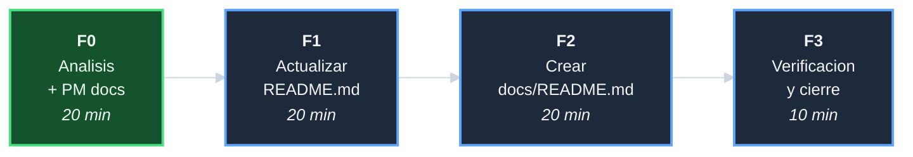

# Plan: Actualizar README y crear indice de documentacion

## DAG de fases

## F0 - Analisis + PM docs (20 min)

| Tarea | Descripcion | Esfuerzo |
|-------|-------------|----------|
| T-001 | Auditar README.md: identificar gaps en inventario, LOC, tests, iniciativas | 10 min |
| T-002 | Auditar docs/: mapear cajones existentes vs modelo arc42 del UI | 5 min |
| T-003 | Crear 6 documentos PM | 5 min |

**Entregables**: 6 archivos PM con inventario de gaps y mapa de cajones.

## F1 - Actualizar README.md (20 min)

| Tarea | Descripcion | Esfuerzo |
|-------|-------------|----------|
| T-101 | Actualizar tabla de inventario: agregar setup.sh y start.sh, corregir LOC | 5 min |
| T-102 | Actualizar tests: 72 → 74 PASS | 2 min |
| T-103 | Actualizar seccion de estado del repo: 7+1 iniciativas, 61 commits | 5 min |
| T-104 | Actualizar enlaces de ref-defs: agregar indice de iniciativas y docs/README | 3 min |
| T-105 | Verificar links internos: sin rotos | 5 min |

**Entregables**: `README.md` con inventario correcto y estado actualizado.

## F2 - Crear docs/README.md (20 min)

| Tarea | Descripcion | Esfuerzo |
|-------|-------------|----------|
| T-201 | Crear `docs/README.md` con indice de cajones existentes | 10 min |
| T-202 | Declarar cajones arc42 ausentes con justificacion | 5 min |
| T-203 | Verificar links del nuevo README | 5 min |

**Entregables**: `docs/README.md` como punto de entrada de la documentacion.

## F3 - Verificacion y cierre (10 min)

| Tarea | Descripcion | Esfuerzo |
|-------|-------------|----------|
| T-301 | `bash tests/run_all.sh` + auditoria de links | 5 min |
| T-302 | Crear `decisiones-*.md`; cerrar index e indice; commit de cierre | 5 min |

**Entregables**: `decisiones-*.md`; iniciativa cerrada.
