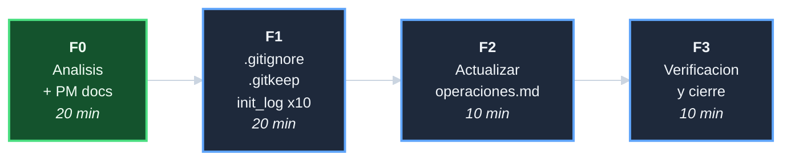

# Plan: Agregar logging a archivo en scripts y provisioners

## DAG de fases

## F0 - Analisis + PM docs (20 min)

| Tarea | Descripcion | Esfuerzo |
|-------|-------------|----------|
| T-001 | Auditar `init_log` en logging.sh; analizar problema de permisos de logs/; inventariar los 10 scripts a modificar | 10 min |
| T-002 | Crear 6 documentos PM siguiendo PROC-GESTION-001 v4.0.0 + arc42 | 10 min |

**Entregables**: 6 archivos PM en `agregar-logging-a-archivo/`.

## F1 - .gitignore, .gitkeep, init_log en 10 scripts (20 min)

| Tarea | Descripcion | Esfuerzo |
|-------|-------------|----------|
| T-101 | Crear o actualizar `.gitignore` con entrada `logs/*.log` | 2 min |
| T-102 | Crear `logs/.gitkeep` (archivo vacio versionado) | 1 min |
| T-103 | Agregar `init_log "operations"` a los 4 scripts de `scripts/` | 5 min |
| T-104 | Agregar `init_log "operations"` a los 6 provisioners | 7 min |
| T-105 | `bash -n` en los 10 scripts modificados | 3 min |
| T-106 | `bash tests/run_all.sh` para verificar sin regresiones | 2 min |

**Entregables**: `.gitignore`, `logs/.gitkeep`, 10 scripts con `init_log`.

## F2 - Actualizar docs/operaciones.md (10 min)

| Tarea | Descripcion | Esfuerzo |
|-------|-------------|----------|
| T-201 | Agregar seccion de logs en `docs/operaciones.md`: ubicacion, consulta en tiempo real (`tail -f`), post-mortem, rotacion manual | 10 min |

**Entregables**: `docs/operaciones.md` con seccion de logs.

## F3 - Verificacion y cierre (10 min)

| Tarea | Descripcion | Esfuerzo |
|-------|-------------|----------|
| T-301 | Verificacion funcional: ejecutar `bash scripts/verify.sh` y confirmar que `logs/operations.log` se crea y acumula | 5 min |
| T-302 | Crear `decisiones-agregar-logging-a-archivo.md`; actualizar index, tareas e indice-de-iniciativas; commit de cierre | 5 min |

**Entregables**: verificacion funcional del log; iniciativa cerrada.
