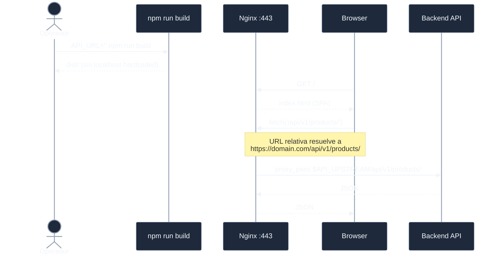

# Analisis: Auditar y corregir gaps entre analisis y la implementacion

## Documento de referencia auditado

`template-ecommerce-ui/docs/desarrollo/analisis-servidor-para-template.md`
(Fecha: 2026-05-21, Estado: Exploratorio).

## Resultado de la auditoria: template-ecommerce-server

### Cumplimiento por seccion del documento

| Propuesta | Estado | Evidencia |
|-----------|--------|-----------|
| Nginx en lugar de Apache | CUMPLE | `provisioners/nginx/install.sh` instala nginx |
| SPA catch-all `try_files $uri $uri/ /index.html` | CUMPLE | `config/nginx/template-https.conf:227` |
| Reverse proxy `/api/*` → `$API_UPSTREAM` agnostico | CUMPLE | `config/nginx/template-https.conf:188-210` |
| SSL via acme.sh + self-signed fallback | CUMPLE | `provisioners/ssl/setup_ssl.sh` |
| fail2ban jails: sshd + nginx-* | CUMPLE (mejorado) | 2 jails nginx: `nginx-limit-req` + `nginx-botsearch` |
| 4 cuentas Linux (sin svc-dbdata) | CUMPLE | `.env.example` header + decision D-CUENTAS |
| 2 clases de almacenamiento (sin C) | CUMPLE | `.env.example` header + decision D-STORAGE |
| Headers HSTS, X-Frame, X-Content, Referrer, X-XSS | CUMPLE | `template-https.conf:112-129` |
| TLS 1.2+ | CUMPLE | `template-https.conf:79` |
| Ciphers ECDHE/CHACHA20 | CUMPLE | `template-https.conf:84` |
| UFW: deny in, allow out, SSH+80+443 | CUMPLE | `provisioners/firewall/setup_firewall.sh` |
| SSH: puerto no estandar, sin password, sin root | CUMPLE | `provisioners/security/setup_ssh_hardening.sh` |
| ~10 checks en verify.sh | CUMPLE | 12 checks (rango aceptable) |
| renew_ssl.sh | CUMPLE | `scripts/renew_ssl.sh` |
| 5 tests bash | CUMPLE | `tests/run_all.sh` ejecuta 5 suites |
| variables .env propuestas | CUMPLE | `.env.example` tiene todas las variables |
| Variables F2B_NGINX_* | CUMPLE (mejorado) | 6 variables F2B_NGINX_LIMIT_REQ_* + BOTSEARCH_* |

### Gaps en template-ecommerce-server

**Gap 1 — `verify.sh`: mensajes de error referencian `systemctl` (BUG)**

```
linea 157: log_error "  Arranca con: sudo systemctl start nginx"
linea 158: log_error "  Estado: sudo systemctl status nginx"
linea 292: log_error "  Nginx activo? sudo systemctl status nginx"
linea 474: log_error "  Arranca con: sudo systemctl start fail2ban"
```

El script `scripts/start.sh` (INI-SRV-006) existe precisamente para
arrancar daemons en entornos sin systemd. Referenciar `systemctl`
directamente en los mensajes de error de verify.sh crea confusion
en WSL2 donde systemd no esta disponible.

**Gap 2 — `upstream.conf` no existe (aceptado, no bug)**

El documento propone `upstream.conf + http.conf + https.conf`. La
implementacion tiene solo `http.conf + https.conf`. El `proxy_pass`
directo en https.conf es funcional para el scope del template. Se
acepta como decision de diseno (D-UPSTREAM-CONF-NO-APLICA).

---

## Resultado de la auditoria: template-ecommerce-ui

### Bug critico: `apiService.js` bypasea el proxy Nginx en produccion

**Archivo**: `src/services/apiService.js`

```js
// linea 36:
this.baseURL = baseURL || process.env.API_URL || '';

// linea 68-69:
const url = new URL(path.startsWith('http') ? path : `${this.baseURL}${path}`);
```

**`src/constants/index.js` linea 6:**

```js
export const API_BASE = process.env.API_URL || 'http://localhost:8000';
```

**`webpack.config.js`:**

```js
'process.env.API_URL': JSON.stringify(
    process.env.API_URL || resolvedEnv.API_URL || 'http://localhost:8000'
),
```

**Problema A — TypeError cuando API_URL esta vacio:**

Si `API_URL = ''` (vacio), entonces en `apiService`:

```
this.baseURL = '' || '' || '' = ''
url = new URL('' + '/api/v1/addresses/') = new URL('/api/v1/addresses/')
```

`new URL('/api/v1/addresses/')` lanza `TypeError: Failed to construct 'URL'`
porque no es una URL absoluta y `new URL` sin segundo argumento requiere
URL absoluta. La app se rompe en produccion si `API_URL` no se configura.

**Problema B — bypass del proxy Nginx cuando API_URL = 'http://localhost:8000':**

El fallback `'http://localhost:8000'` en webpack.config.js hace que en
produccion sin `.env.production` explícita:

```
process.env.API_URL = 'http://localhost:8000'  (baked at build time)
this.baseURL = 'http://localhost:8000'
url = new URL('http://localhost:8000/api/v1/addresses/')
```

El browser hace una request directa a `http://localhost:8000`, bypasseando
el proxy `/api/*` de Nginx. Esto funciona SOLO si el backend corre en
localhost:8000 del server con CORS abierto — no es el caso general.

**La arquitectura correcta para el proxy Nginx:**

```
API_URL = '' (vacio)
  ↓
apiService construye URL relativa: '/api/v1/addresses/'
  ↓
Browser resuelve contra window.location.origin: 'https://domain.com/api/v1/addresses/'
  ↓
Nginx intercepta /api/* y proxea a $API_UPSTREAM
  ↓
Backend responde
```

**Fix requerido en `apiService.js`:**

```js
// Antes:
const url = new URL(path.startsWith('http') ? path : `${this.baseURL}${path}`);

// Despues:
const resolvedPath = path.startsWith('http')
    ? path
    : `${this.baseURL}${path}`;
const base = typeof window !== 'undefined' ? window.location.origin : 'http://localhost';
const url = resolvedPath.startsWith('http')
    ? new URL(resolvedPath)
    : new URL(resolvedPath, base);
```

**Fix requerido en `constants/index.js`:**

```js
// Antes:
export const API_BASE = process.env.API_URL || 'http://localhost:8000';

// Despues:
export const API_BASE = process.env.API_URL || '';
```

**Fix requerido en `webpack.config.js`:**

```js
// Antes:
'process.env.API_URL': JSON.stringify(
    process.env.API_URL || resolvedEnv.API_URL || 'http://localhost:8000'
),

// Despues:
'process.env.API_URL': JSON.stringify(
    process.env.API_URL || resolvedEnv.API_URL || ''
),
```

### MSW en produccion: correctamente guardado

```js
// src/index.jsx linea 24:
if (process.env.NODE_ENV !== 'production') {
```

webpack.config.js reemplaza `process.env.NODE_ENV` con `'production'`
en el bundle de produccion. Minificacion/tree-shaking elimina el bloque
`if (false)`. MSW NO se activa en produccion. No hay gap aqui.

### webpack produce dist/ compatible con Nginx: confirmado

```js
output: {
    path: path.resolve(__dirname, 'dist'),
    filename: '[name].[contenthash].js',   // cache-busting con hash
    publicPath: '/',                        // rutas absolutas desde /
    clean: true,
},
```

- `publicPath: '/'` alinea con `root %%UI_DIST%%` de Nginx
- `[contenthash]` alinea con `cache 1y immutable` de Nginx para assets
- `HtmlWebpackPlugin` genera `index.html` que Nginx sirve como SPA catch-all
- Sin supuestos de Django ni backend especifico en el bundle

## Diagrama del flujo de produccion correcto



## Resumen de gaps a corregir

| Gap | Repo | Severidad | Fix |
|-----|------|-----------|-----|
| verify.sh: 3 mensajes con systemctl | server | Menor | Reemplazar con start.sh |
| apiService.js: TypeError con API_URL vacio | UI | Critico | URL construction con window.location.origin |
| constants/index.js: fallback localhost:8000 | UI | Alto | Eliminar fallback |
| webpack.config.js: fallback localhost:8000 | UI | Alto | Eliminar fallback |
