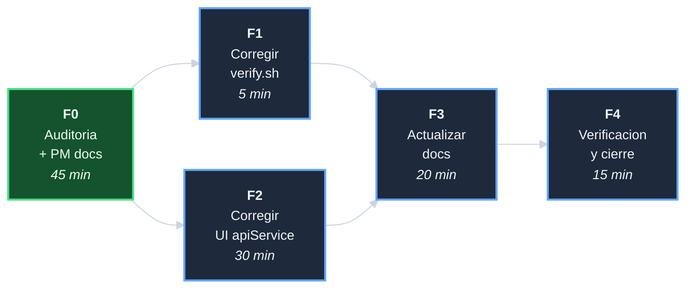

# Plan: Auditar y corregir gaps entre analisis y la implementacion

## DAG de fases

F1 y F2 son paralelas (repos distintos, sin dependencias entre si).
F3 depende de ambas (documenta los cambios producidos en F1 y F2).

## F0 - Auditoria + PM docs (45 min)

| Tarea | Descripcion | Esfuerzo |
|-------|-------------|----------|
| T-001 | Leer `analisis-servidor-para-template.md` e inventariar propuestas | 10 min |
| T-002 | Auditar `template-ecommerce-server` contra la propuesta | 15 min |
| T-003 | Auditar `template-ecommerce-ui` (apiService, webpack, MSW) | 15 min |
| T-004 | Crear 6 docs PM con hallazgos concretos | 5 min |

**Entregables**: 6 archivos PM. Inventario de gaps con evidencia de codigo.

## F1 - Corregir verify.sh en server (5 min)

| Tarea | Descripcion | Esfuerzo |
|-------|-------------|----------|
| T-101 | Reemplazar 3 ocurrencias de `systemctl start nginx/fail2ban` por `bash scripts/start.sh` | 3 min |
| T-102 | `bash -n` + `bash tests/run_all.sh` | 2 min |

**Entregables**: `scripts/verify.sh` corregido. Tests: PASS >= 74.

## F2 - Corregir UI apiService + constants + webpack (30 min)

| Tarea | Descripcion | Esfuerzo |
|-------|-------------|----------|
| T-201 | Corregir `src/services/apiService.js`: URL construction con `window.location.origin` como base cuando `baseURL` esta vacio | 15 min |
| T-202 | Corregir `src/constants/index.js`: eliminar fallback `http://localhost:8000` | 5 min |
| T-203 | Corregir `webpack.config.js`: eliminar fallback `http://localhost:8000` en `API_URL` | 5 min |
| T-204 | `npm test` en el UI para verificar que no hay regresiones | 5 min |

**Entregables**: 3 archivos del UI corregidos. Tests del UI mantenidos.

## F3 - Actualizar documentacion (20 min)

| Tarea | Descripcion | Esfuerzo |
|-------|-------------|----------|
| T-301 | Actualizar `.env.example` del server: documentar `API_UPSTREAM` y su relacion con `API_URL` del UI | 10 min |
| T-302 | Actualizar `README.md` del server: seccion de despliegue con nota sobre `API_URL` en el UI | 5 min |
| T-303 | Actualizar `README.md` del UI: documentar `API_URL` para produccion con Nginx | 5 min |

**Entregables**: documentacion coherente en ambos repos.

## F4 - Verificacion y cierre (15 min)

| Tarea | Descripcion | Esfuerzo |
|-------|-------------|----------|
| T-401 | `bash tests/run_all.sh` en server + auditoria de links | 5 min |
| T-402 | Verificar `apiService` con `API_URL = ''`: no TypeError | 5 min |
| T-403 | Crear `decisiones-auditar-gaps-server-y-ui.md`; cerrar index e indice; commits de cierre en ambos repos | 5 min |

**Entregables**: `decisiones-*.md`; ambas iniciativas cerradas.
