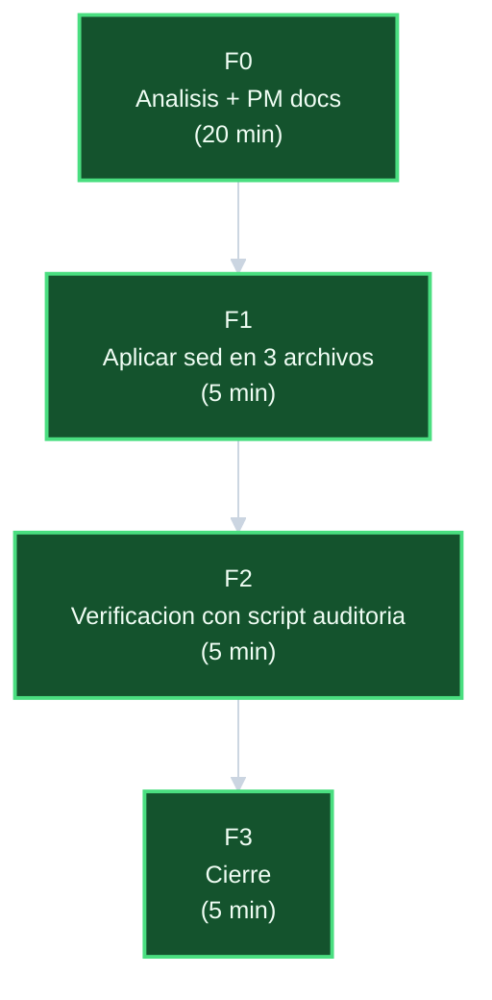

# Plan — `corregir-links-navegacion-historica`

## DAG de fases

## Fases y tareas

### F0 — Analisis + PM docs

| ID | Tarea | Estimado | Estado |
|----|-------|----------|--------|
| T-001 | Auditoria con script Python: identificar todos los links rotos | 10 min | CERRADA |
| T-002 | Verificar existencia de archivos destino correctos | 3 min | CERRADA |
| T-003 | Verificar inexistencia de archivos apuntados por links rotos | 2 min | CERRADA |
| T-004 | Definir patron sed y validar no-colision con texto visible | 5 min | CERRADA |
| T-005 | Crear 6 documentos PM de la iniciativa | 20 min | CERRADA |

### F1 — Aplicar correccion en 3 archivos

| ID | Tarea | Estimado | Estado |
|----|-------|----------|--------|
| T-101 | Aplicar sed en `index.md` | 1 min | PENDIENTE |
| T-102 | Aplicar sed en `alcance-crear-template-ecomerce-ui-server.md` | 1 min | PENDIENTE |
| T-103 | Aplicar sed en `plan-crear-template-ecomerce-ui-server.md` | 1 min | PENDIENTE |
| T-104 | Verificar que `progreso-*.md` y `tareas-*.md` no fueron modificados (`git diff`) | 2 min | PENDIENTE |
| T-105 | Verificar que titulos y slugs siguen intactos (`grep` del patron sin `.md`) | 1 min | PENDIENTE |
| T-106 | Commit F1 | 1 min | PENDIENTE |

### F2 — Verificacion con script auditoria

| ID | Tarea | Estimado | Estado |
|----|-------|----------|--------|
| T-201 | Ejecutar script Python de auditoria completo | 3 min | PENDIENTE |
| T-202 | Confirmar 0 links rotos en `crear-template-ecomerce-ui-server/` | 2 min | PENDIENTE |

### F3 — Cierre

| ID | Tarea | Estimado | Estado |
|----|-------|----------|--------|
| T-301 | Actualizar progreso con eventos de cierre | 2 min | PENDIENTE |
| T-302 | Actualizar index con Estado=Cerrada | 1 min | PENDIENTE |
| T-303 | Actualizar tareas con estados CERRADA | 1 min | PENDIENTE |
| T-304 | Commit de cierre F3 | 1 min | PENDIENTE |

## Totales

| Fase | Estimado |
|------|----------|
| F0 | 20 min |
| F1 | 7 min |
| F2 | 5 min |
| F3 | 5 min |
| Total | 37 min |
