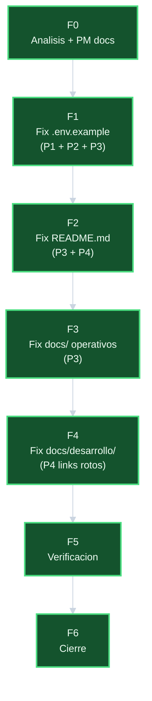

# Plan — `corregir-paths-ecom-a-tui-server`

## DAG de fases

## Fases y tareas

### F0 — Analisis + PM docs

| ID | Tarea | Estimado |
|----|-------|----------|
| T-001 | Inventario grep de los 4 patrones | 10 min |
| T-002 | Validacion de no-colisiones con referentes externos | 5 min |
| T-003 | Crear 6 documentos PM de la iniciativa | 5 min |

### F1 — Fix `.env.example`

| ID | Tarea | Estimado |
|----|-------|----------|
| T-101 | Corregir P1: `template-ecomerce-ui-server` → `template-ecommerce-server` | 2 min |
| T-102 | Corregir P2: `template-e-comerce-ui` → `template-ecommerce-ui` | 2 min |
| T-103 | Corregir P3: `/srv/repos/ecom/` → `/srv/repos/tui/` | 1 min |
| T-104 | Verificar grep post-sed: 0 resultados de P1+P2+P3 | 1 min |

### F2 — Fix `README.md`

| ID | Tarea | Estimado |
|----|-------|----------|
| T-201 | Corregir P3: `/srv/repos/ecom/` → `/srv/repos/tui/` | 1 min |
| T-202 | Corregir P4: links `crear-template-ecommerce-server` | 2 min |
| T-203 | Verificar grep post-sed: 0 resultados de P3+P4 | 2 min |

### F3 — Fix `docs/` operativos

| ID | Tarea | Estimado |
|----|-------|----------|
| T-301 | Corregir P3 en `docs/arquitectura.md` | 1 min |
| T-302 | Corregir P3 en `docs/desarrollo/decision-storage-clases.md` | 1 min |
| T-303 | Corregir P3 en `docs/glosario.md` | 1 min |
| T-304 | Corregir P3 en `docs/operaciones.md` | 1 min |
| T-305 | Corregir P3 en `docs/seguridad.md` | 1 min |
| T-306 | Verificar grep post-sed: 0 resultados de P3 en docs/ | 3 min |

### F4 — Fix `docs/desarrollo/` links rotos

| ID | Tarea | Estimado |
|----|-------|----------|
| T-401 | Corregir P4 en `docs/desarrollo/decision-modelo-cuentas.md` | 1 min |
| T-402 | Corregir P4 en `docs/desarrollo/decision-nginx-vs-apache.md` | 1 min |
| T-403 | Verificar grep post-sed: 0 resultados de P4 en docs/desarrollo/ | 2 min |

### F5 — Verificacion global

| ID | Tarea | Estimado |
|----|-------|----------|
| T-501 | grep global P1+P2+P3+P4: 0 resultados en archivos operativos | 3 min |
| T-502 | grep referentes externos preservados | 2 min |

### F6 — Cierre

| ID | Tarea | Estimado |
|----|-------|----------|
| T-601 | Actualizar estado de iniciativa a Cerrada | 1 min |
| T-602 | Commit de cierre | 1 min |

## Totales

| Fase | Estimado |
|------|----------|
| F0 | 20 min |
| F1 | 6 min |
| F2 | 5 min |
| F3 | 8 min |
| F4 | 4 min |
| F5 | 5 min |
| F6 | 2 min |
| Total | 50 min |
