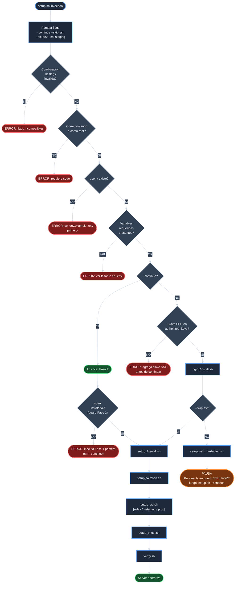
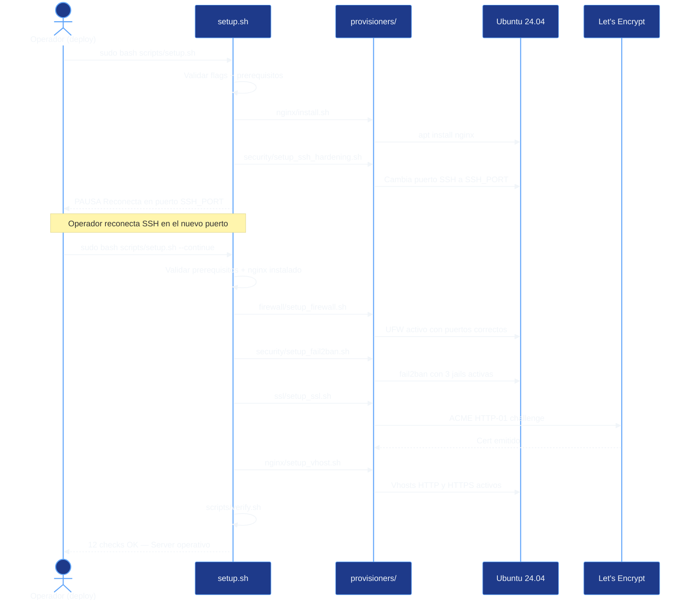
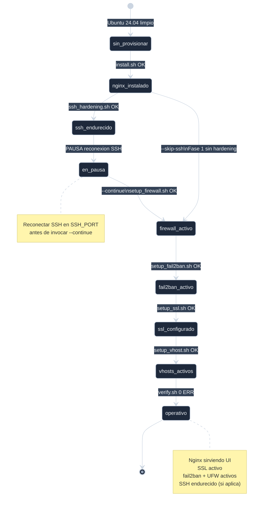

# Analisis — `crear-setup-sh`

## Inventario del estado actual

### Scripts existentes en `scripts/`

| Archivo | LOC | Proposito |
|---------|-----|-----------|
| `scripts/verify.sh` | ~350 | Verificacion del entorno (12 checks) |
| `scripts/renew_ssl.sh` | ~120 | Renovacion periodica de SSL |

`scripts/setup.sh` no existe. Tampoco `scripts/start.sh`.

### Provisioners existentes y orden critico

El orden de ejecucion NO es arbitrario. Las dependencias son:

| Paso | Script | Depende de |
|------|--------|------------|
| 1 | `provisioners/nginx/install.sh` | Ninguno |
| 2 | `provisioners/security/setup_ssh_hardening.sh` | Paso 1 (define SSH_PORT efectivo antes que UFW) |
| 3 | `provisioners/firewall/setup_firewall.sh` | Paso 2 (UFW permite SSH_PORT; si se activa antes, lockout) |
| 4 | `provisioners/security/setup_fail2ban.sh` | Paso 3 (banaction=ufw requiere UFW activo) |
| 5 | `provisioners/ssl/setup_ssl.sh` | Paso 1 (nginx instalado para ACME challenge) |
| 6 | `provisioners/nginx/setup_vhost.sh` | Paso 5 (cert SSL debe existir para vhost HTTPS) |
| 7 | `scripts/verify.sh` | Pasos 1-6 completos |

### Helpers disponibles en `utils/`

`setup.sh` puede sourcer los mismos utils que usan los provisioners:

| Funcion | Archivo | Uso en setup.sh |
|---------|---------|-----------------|
| `is_systemd()` | `core.sh` | Detectar entorno para mensajes |
| `command_exists()` | `core.sh` | Verificar que nginx esta instalado (guard Fase 2) |
| `log_header()`, `log_info()`, `log_success()`, `log_error()`, `log_warn()` | `logging.sh` | Output estructurado |

### Problema central: lockout SSH

`setup_ssh_hardening.sh` escribe
`/etc/ssh/sshd_config.d/99-template-ecommerce-server.conf`
con el nuevo `SSH_PORT` y recarga sshd. A partir de ese
momento el servidor solo acepta conexiones en el nuevo
puerto. Si `setup_firewall.sh` se ejecuta inmediatamente
despues (mismo proceso), UFW activa `deny incoming` y permite
solo el nuevo puerto — cortando la sesion SSH activa si el
operador no ha reconectado.

La unica solucion segura es pausar entre paso 2 y paso 3,
dar instrucciones de reconexion al operador, y retomar con
un flag.

## Diagrama de flujo de decision de `setup.sh`

## Diagrama de interaccion operador-script

## Diagrama de estados del servidor

## Validacion de no-colisiones

`setup.sh` no modifica ningun archivo de configuracion
existente. Solo invoca provisioners como subprocesos.
Los provisioners son los que modifican el sistema; cada uno
tiene su propia logica de idempotencia y rollback.

`test_provisioner_syntax.sh` usa `find` sobre todos los `.sh`
del repo. Al agregar `scripts/setup.sh`, queda cubierto
automaticamente sin tocar el test.

## Estrategia de ejecucion

El script se construye en funciones privadas con prefijo `_`,
igual que los provisioners existentes. Sourcera
`utils/logging.sh` y `utils/core.sh` para usar los mismos
helpers de output y deteccion de entorno. El MAIN al final
parsea flags, llama guards, y despacha a `_run_fase1` o
`_run_fase2` segun corresponda.

## Riesgos identificados

| ID | Riesgo | Mitigacion |
|----|--------|------------|
| R-1 | Operador usa `--continue` sin haber ejecutado Fase 1 | Guard verifica que nginx este instalado (`command_exists nginx`) antes de Fase 2; si falla, aborta con instrucciones |
| R-2 | Combinacion invalida de flags (`--skip-ssh` + `--continue`) | `_parse_flags` detecta combinaciones invalidas y aborta antes de ejecutar nada |
| R-3 | `--ssl-dev` usado en servidor de produccion real | Advertencia visible si `DOMAIN` != `localhost`; el operador debe confirmar |
| R-4 | Guard de clave SSH no detecta la clave del usuario real | Documentado en usage: ejecutar como el usuario que tiene la clave SSH, no como otro usuario distinto |

## Conclusion

El unico problema de diseno no trivial es el lockout SSH,
y tiene solucion clara: dos fases con pausa y flag `--continue`.
El resto es orquestacion directa de provisioners existentes
reutilizando los helpers de `utils/`. La implementacion
es de bajo riesgo porque no modifica nada existente y los
provisioners individuales siguen siendo el mecanismo de
fallback si `setup.sh` no funciona en algun escenario.
