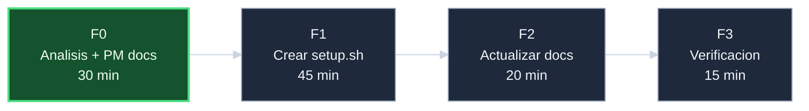

# Plan — `crear-setup-sh`

## Fases F0..F3

El trabajo se organiza en **4 fases secuenciales**. Cada fase
produce uno o mas commits unitarios.

| Fase | Nombre | Esfuerzo | Pre-condiciones | Que produce |
|------|--------|----------|-----------------|-------------|
| **F0** | Analisis + PM docs | 30 min | Iniciativa abierta | 6 documentos PM, 3 diagramas Mermaid |
| **F1** | Crear `scripts/setup.sh` | 45 min | F0 cerrada | Script funcional con 2 fases y 4 flags |
| **F2** | Actualizar documentacion | 20 min | F1 cerrada | `README.md`, `docs/operaciones.md`, `docs/arquitectura.md` actualizados |
| **F3** | Verificacion y cierre | 15 min | F2 cerrada | Tests pasando, iniciativa cerrada |
| **Total** | | **~2 horas** | | |

## DAG de fases



## Disciplina por fase

Para cada fase:

1. **Antes de empezar**: registrar evento `Inicio de fase`
   en [progreso][doc-progreso].
2. **Durante la ejecucion**: cualquier hallazgo se registra
   como `Hallazgo durante la ejecucion` en el turno en que
   se produce, no al cierre.
3. **Antes de commitear**: verificar que `bash tests/run_all.sh`
   retorna FAIL = 0.
4. **Al cerrar**: registrar evento `Fase cerrada` con resumen
   de metricas (LOC producidas, tests, hallazgos).

## Estilo de commits

Tim Pope (subject <=50 chars, wrap body 72 chars).
Subject sugerido: `<Verbo> <objeto> (F<n>)`. Ejemplos:

- `Add F0 PM docs for crear-setup-sh`
- `Implement scripts/setup.sh (F1)`
- `Update docs with setup.sh entry point (F2)`
- `Close initiative crear-setup-sh (F3)`

Verificar longitud antes de commitear:
```bash
s=$(git log -1 --pretty=format:'%s') && echo "subj($(echo -n "$s" | wc -c)): $s"
```

## Decisiones aplicables a todas las fases

- **Patron de scripts**: `set -euo pipefail`, source de
  `utils/logging.sh` y `utils/core.sh`, funciones privadas
  con prefijo `_`, MAIN al final.
- **Sin hardcodear rutas**: usar `SCRIPT_DIR` y
  `PROJECT_ROOT` calculados dinamicamente como en los
  provisioners existentes.
- **Idempotencia heredada**: `setup.sh` no implementa
  idempotencia propia; la delega a los provisioners.
- **Mensajes de usuario en castellano**: consistente con
  el resto del proyecto.

## Pre-condiciones globales

- Los 8 provisioners existentes funcionan correctamente
  (ya verificado por `tests/run_all.sh`).
- `utils/core.sh` y `utils/logging.sh` son soureables
  desde `scripts/` (ya funciona en `verify.sh`).
- No hay cambios pendientes en el working tree antes de
  iniciar F1 (`git status -s` == 0).

## Riesgos del plan

| Riesgo | Mitigacion |
|--------|------------|
| La logica de deteccion de combinaciones invalidas de flags se complica mas de lo estimado | Mantener la logica de flags lo mas simple posible: tabla de combinaciones validas vs invalidas decidida en F0; no extender el alcance |
| F2 encuentra que los docs tienen secciones muy extensas que requieren restructuracion mayor | Limitar F2 a agregar `setup.sh` en los flujos existentes sin restructurar; restructuracion mayor es iniciativa separada |

## Que sigue tras esta iniciativa

Cuando se cierre:

1. El servidor tiene un punto de entrada unificado para
   aprovisionamiento.
2. La siguiente iniciativa natural es `crear-start-sh`:
   arranque de daemons en entorno WSL2 sin systemd.
3. Posible futura: CI/CD que ejecute `setup.sh --skip-ssh
   --ssl-dev` en un contenedor como smoke test de
   integracion.

<!-- Referencias Markdown -->
[doc-progreso]: progreso-crear-setup-sh.md
[repo-server]: https://github.com/jcg-admin/template-ecommerce-server
