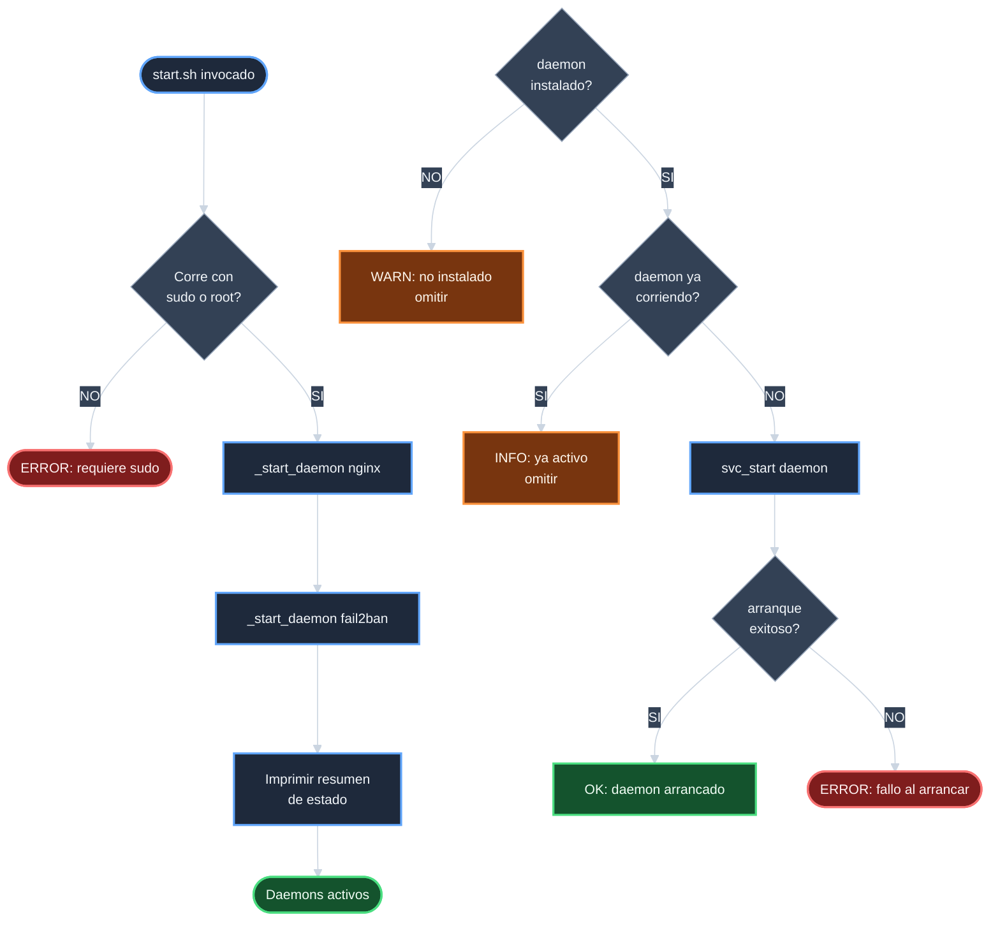

# Analisis — `crear-start-sh`

## Inventario del estado actual

### Scripts existentes en `scripts/`

| Archivo | Proposito |
|---------|-----------|
| `scripts/setup.sh` | Aprovisionamiento en dos fases |
| `scripts/verify.sh` | Verificacion del entorno (12 checks) |
| `scripts/renew_ssl.sh` | Renovacion periodica de SSL |

`scripts/start.sh` no existe.

### Helpers disponibles en `utils/core.sh`

`start.sh` puede reutilizar directamente:

| Funcion | Comportamiento con systemd | Comportamiento sin systemd |
|---------|---------------------------|----------------------------|
| `svc_is_active nginx` | `systemctl is-active nginx` | `service nginx status` |
| `svc_start nginx` | `systemctl start nginx` | `/usr/sbin/nginx` |
| `svc_is_active fail2ban` | `systemctl is-active fail2ban` | `service fail2ban status` |
| `svc_start fail2ban` | `systemctl start fail2ban` | `fail2ban-server -b` |
| `is_systemd` | Retorna 0 (true) | Retorna 1 (false) |
| `command_exists` | Guards de prerequisito | Guards de prerequisito |

Estos wrappers encapsulan completamente la logica de deteccion
de entorno. `start.sh` no necesita invocar comandos nativos
directamente.

### Daemons a arrancar

| Daemon | Comando sin systemd | Nota |
|--------|--------------------|----|
| Nginx | `/usr/sbin/nginx` (via `svc_start nginx`) | Master hace fork a workers automaticamente |
| fail2ban | `fail2ban-server -b` (via `svc_start fail2ban`) | `-b` = background |

`sshd` excluido por D-NO-SSHD.

## Diagrama de flujo de `start.sh`

## Validacion de no-colisiones

`start.sh` no modifica ningun archivo de configuracion.
Solo invoca wrappers de `core.sh` que internamente llaman
a los binarios o a systemd. `test_provisioner_syntax.sh`
cubre automaticamente `start.sh` sin modificacion.

## Estrategia de ejecucion

Una funcion privada `_start_daemon <nombre>` encapsula el
flujo: verificar instalacion, verificar si ya corre, arrancar
si es necesario, reportar resultado. El MAIN la invoca dos
veces: primero para nginx, luego para fail2ban.

## Riesgos identificados

| ID | Riesgo | Mitigacion |
|----|--------|------------|
| R-1 | `svc_is_active` retorna falso positivo en WSL2 para un daemon que arranco pero fallo | Despues de `svc_start`, el script verifica de nuevo con `svc_is_active` para confirmar que el daemon esta realmente activo |
| R-2 | fail2ban no puede arrancar si nginx no esta corriendo (las jails nginx-* monitorizan logs de nginx) | El script arranca nginx primero; fail2ban se arranca despues. El orden esta documentado y es fijo. |

## Conclusion

`start.sh` es el script mas simple de esta serie. Toda la
complejidad de deteccion de entorno ya vive en `core.sh`.
El unico riesgo no trivial (R-1, falso positivo de
`svc_is_active`) se mitiga con una segunda verificacion
post-arranque. La implementacion es de muy bajo riesgo.
