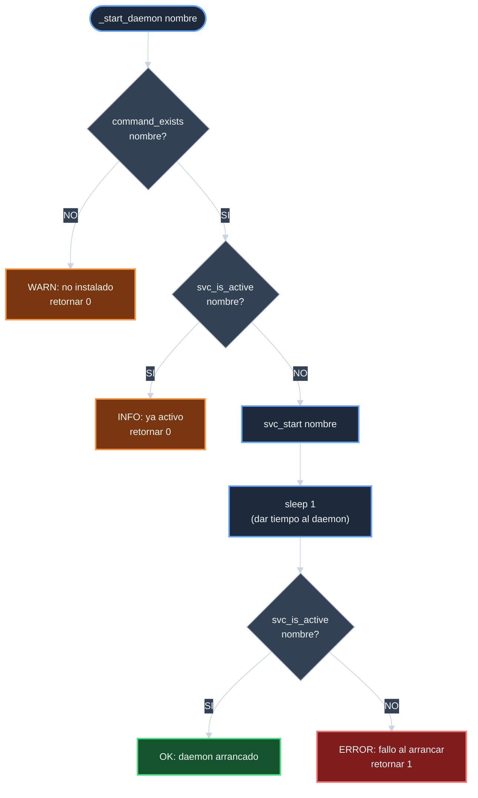

# Analisis: Crear script de arranque de daemons

## Inventario del estado actual

### Scripts existentes en `scripts/`

| Archivo | Proposito |
|---------|-----------|
| `scripts/setup.sh` | Aprovisionamiento en dos fases (INI-SRV-005) |
| `scripts/verify.sh` | Verificacion del entorno (12 checks) |
| `scripts/renew_ssl.sh` | Renovacion periodica de SSL |

`scripts/start.sh` no existe.

### Helpers disponibles en `utils/core.sh`

| Funcion | Con systemd | Sin systemd |
|---------|-------------|-------------|
| `svc_is_active nginx` | `systemctl is-active nginx` | `service nginx status` |
| `svc_start nginx` | `systemctl start nginx` | `/usr/sbin/nginx` |
| `svc_is_active fail2ban` | `systemctl is-active fail2ban` | `service fail2ban status` |
| `svc_start fail2ban` | `systemctl start fail2ban` | `fail2ban-server -b` |
| `command_exists` | Guard de instalacion | Guard de instalacion |
| `log_*` | Output estructurado | Output estructurado |

Todos los wrappers necesarios existen. `start.sh` no necesita
invocar binarios directamente.

### Daemons a arrancar y orden

| Orden | Daemon | Razon del orden |
|-------|--------|-----------------|
| 1 | Nginx | Independiente; las jails nginx-* de fail2ban monitorizan sus logs |
| 2 | fail2ban | Depende logicamente de que nginx este activo para monitorizar sus logs |

### Diagrama de flujo de `_start_daemon`

## Validacion de no-colisiones

`start.sh` no modifica ningun archivo de configuracion.
Solo invoca wrappers de `core.sh`. `test_provisioner_syntax.sh`
cubre automaticamente `start.sh` al usar `find` sobre todos
los `.sh` del repo.

## Estrategia de ejecucion

Una funcion `_start_daemon <nombre>` encapsula el flujo de un
daemon. El MAIN la invoca dos veces: primero nginx, luego
fail2ban. Un `sleep 1` entre `svc_start` y la verificacion
post-arranque da tiempo al daemon para inicializarse.

## Riesgos identificados

| ID | Riesgo | Mitigacion |
|----|--------|------------|
| R-1 | `svc_is_active` retorna falso positivo para un daemon que arranco pero fallo | Segunda verificacion (`check_post`) tras un `sleep 1` confirma que el daemon esta realmente activo |
| R-2 | fail2ban no inicia si sus logs de nginx no existen aun | El script arranca nginx primero; si nginx esta activo, sus logs existen. El orden fijo en MAIN mitiga este riesgo |
