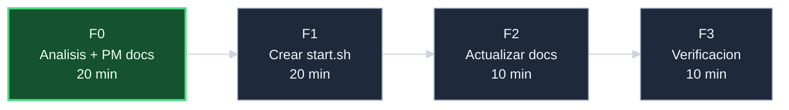

# Plan — `crear-start-sh`

## Fases F0..F3

| Fase | Nombre | Esfuerzo | Pre-condiciones | Que produce |
|------|--------|----------|-----------------|-------------|
| **F0** | Analisis + PM docs | 20 min | Iniciativa abierta | 6 documentos PM, 1 diagrama Mermaid |
| **F1** | Crear `scripts/start.sh` | 20 min | F0 cerrada | Script funcional con `_start_daemon`, idempotente |
| **F2** | Actualizar documentacion | 10 min | F1 cerrada | `README.md`, `docs/upgrade-server-systemless.md` actualizados |
| **F3** | Verificacion y cierre | 10 min | F2 cerrada | Tests pasando, iniciativa cerrada |
| **Total** | | **~1 hora** | | |

## DAG de fases

## Disciplina por fase

Para cada fase:

1. Registrar `Inicio de fase` en progreso antes de cualquier accion.
2. Registrar `Inicio de tarea` al empezar cada tarea.
3. Registrar hallazgos en el turno en que se producen.
4. Verificar `bash -n` y `bash tests/run_all.sh` antes de commitear.
5. Registrar `Fase cerrada` con metricas.
6. Validar longitud del subject: `echo -n "$subj" | wc -c`.

## Estilo de commits

Tim Pope (subject <=50 chars). Ejemplos:

- `Add F0 PM docs for crear-start-sh`
- `Implement scripts/start.sh (F1)`
- `Update docs with start.sh reference (F2)`
- `Close initiative crear-start-sh (F3)`

## Decisiones aplicables a todas las fases

- Usar `svc_is_active` y `svc_start` de `core.sh`; no invocar
  binarios directamente.
- El orden de arranque es fijo: Nginx antes que fail2ban.
- Sin flags: el script no necesita flags para su proposito
  minimo. La idempotencia hace innecesario un `--force`.

## Pre-condiciones globales

- `utils/core.sh` sourceable desde `scripts/` (ya verificado
  por `setup.sh` y `verify.sh`).
- Los provisioners de Nginx y fail2ban ejecutados previamente
  (el script los arranca; no los instala).
- Working tree limpio antes de F1 (`git status -s` == 0).

## Riesgos del plan

| Riesgo | Mitigacion |
|--------|------------|
| `svc_is_active` no detecta correctamente en WSL2 un daemon que arranco pero fallo inmediatamente | Segunda verificacion post-arranque en `_start_daemon`; el script reporta el estado real en el resumen final |

## Que sigue tras esta iniciativa

- El repo tiene los 3 scripts operativos principales:
  `setup.sh` (provisionar), `start.sh` (arrancar),
  `verify.sh` (verificar).
- Posible iniciativa futura: `scripts/stop.sh` para detener
  daemons ordenadamente en entornos sin systemd.

<!-- Referencias Markdown -->
[doc-progreso]: progreso-crear-start-sh.md
[repo-server]: https://github.com/jcg-admin/template-ecommerce-server
