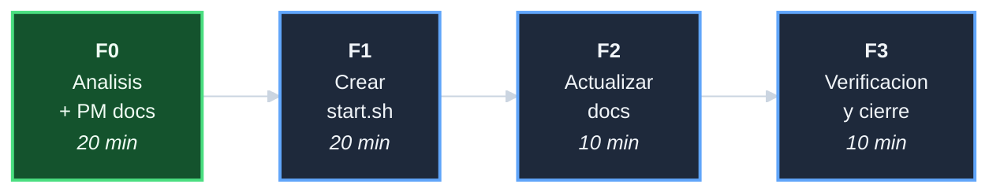

# Plan: Crear script de arranque de daemons

## DAG de fases

## F0 - Analisis + PM docs (20 min)

| Tarea | Descripcion | Esfuerzo |
|-------|-------------|----------|
| T-001 | Leer `utils/core.sh` wrappers `svc_*`, `docs/upgrade-server-systemless.md` y `scripts/setup.sh` como referencia de patron | 10 min |
| T-002 | Disenar flujo de `_start_daemon`, orden de arranque y riesgos; aprobar 5 decisiones D-* | 5 min |
| T-003 | Crear 6 documentos PM siguiendo el procedimiento real del repo UI | 5 min |

**Entregables**: 6 archivos PM en `crear-start-sh/`.

## F1 - Crear `scripts/start.sh` (20 min)

| Tarea | Descripcion | Esfuerzo |
|-------|-------------|----------|
| T-101 | Header, boilerplate (`set -euo pipefail`, SCRIPT_DIR, PROJECT_ROOT, source utils) | 3 min |
| T-102 | Funcion `_start_daemon`: guard de instalacion, `svc_is_active`, `svc_start`, sleep, verificacion post-arranque | 10 min |
| T-103 | MAIN: check sudo/root, `_start_daemon nginx`, `_start_daemon fail2ban`, resumen final | 5 min |
| T-104 | `bash -n scripts/start.sh` y `bash tests/run_all.sh` | 2 min |

**Entregables**: `scripts/start.sh` funcional; tests/run_all.sh PASS >= 74.

## F2 - Actualizar documentacion (10 min)

| Tarea | Descripcion | Esfuerzo |
|-------|-------------|----------|
| T-201 | Agregar seccion de arranque WSL2 en `README.md` | 5 min |
| T-202 | Referenciar `start.sh` en `docs/upgrade-server-systemless.md` resumen ejecutivo | 5 min |

**Entregables**: `README.md` y `docs/upgrade-server-systemless.md` actualizados.

## F3 - Verificacion y cierre (10 min)

| Tarea | Descripcion | Esfuerzo |
|-------|-------------|----------|
| T-301 | `bash tests/run_all.sh` y auditoria de links | 5 min |
| T-302 | Revision manual de `start.sh`: guards, orden, mensajes, idempotencia | 3 min |
| T-303 | Crear `decisiones-crear-start-sh.md`; actualizar progreso, index, indice-de-iniciativas; commit de cierre | 2 min |

**Entregables**: `decisiones-crear-start-sh.md`; iniciativa formalmente cerrada.
