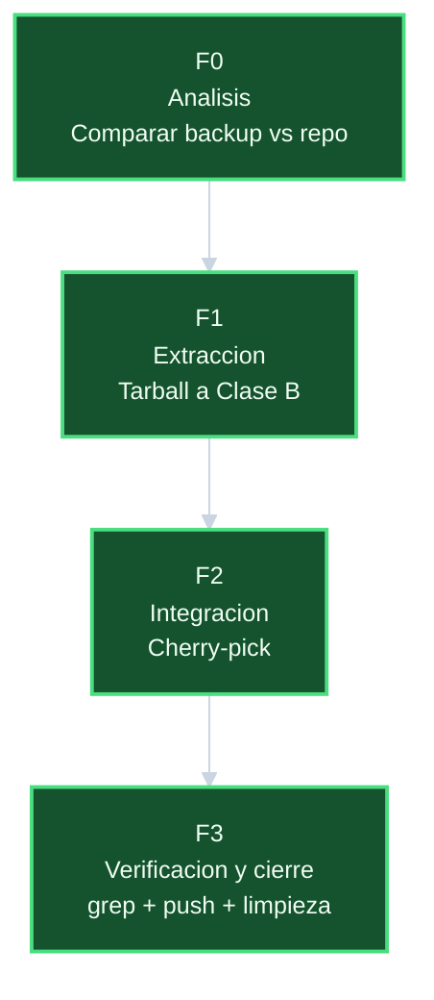

# Plan — `integrar-commits-backup-20260522`

## DAG de fases

## Fases y tareas

### F0 — Analisis

| ID | Tarea | Esfuerzo real |
|----|-------|---------------|
| T-001 | Verificar MD5 del tarball | 2 min |
| T-002 | Listar contenido del tarball | 2 min |
| T-003 | Comparar historiales backup vs repo | 5 min |
| T-004 | Identificar commits faltantes y su impacto | 6 min |

### F1 — Extraccion a Clase B

| ID | Tarea | Esfuerzo real |
|----|-------|---------------|
| T-101 | Copiar tarball a Clase B como `svc-backups` | 2 min |
| T-102 | Extraer tarball en Clase B | 2 min |
| T-103 | Verificar extraccion | 1 min |

### F2 — Integracion

| ID | Tarea | Esfuerzo real |
|----|-------|---------------|
| T-201 | Agregar remoto `backup-local` desde Clase B | 1 min |
| T-202 | Fetch del remoto | 1 min |
| T-203 | Cherry-pick `10abbf9` | 1 min |
| T-204 | Cherry-pick `fd5fda8` | 1 min |

### F3 — Verificacion y cierre

| ID | Tarea | Esfuerzo real |
|----|-------|---------------|
| T-301 | Verificar log y status post-cherry-pick | 2 min |
| T-302 | grep de nomenclatura vieja en archivos operativos | 2 min |
| T-303 | Push a origin | 1 min |
| T-304 | Eliminar remoto `backup-local` | 1 min |

## Totales

| Fase | Esfuerzo real |
|------|---------------|
| F0 | 15 min |
| F1 | 5 min |
| F2 | 4 min |
| F3 | 6 min |
| Total | 30 min |
