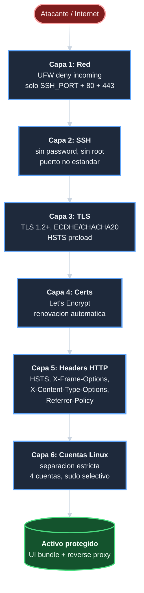
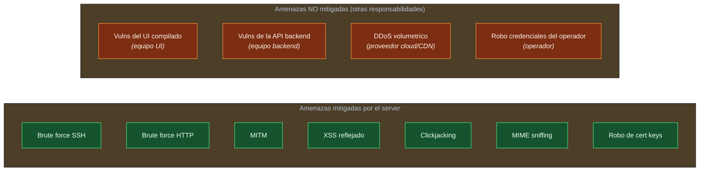

# Seguridad — `template-ecommerce-server`

| Campo | Valor |
|-------|-------|
| Documento | Resumen de decisiones de seguridad del server. |
| Estado | **Esqueleto con decisiones aprobadas**. Detalles concretos se llenan en F5 (SSL), F6 (fail2ban + SSH), F7 (firewall). |
| Audiencia | Auditores de seguridad, operadores, equipo de incident response. |

## Resumen de la postura de seguridad

El server aplica **defensa en profundidad** con 6 capas:



1. **Red (UFW)**: deny incoming + allow outgoing + abre solo
   `SSH_PORT`, `80`, `443`.
2. **SSH endurecido**: sin password, sin root, puerto no
   estandar, ratelimit por fail2ban.
3. **TLS moderno**: TLS 1.2+ exclusivo, ciphers ECDHE/CHACHA20,
   no session tickets.
4. **Certificados Let's Encrypt** con renovacion automatica.
5. **Headers HTTP de seguridad**: HSTS preload, X-Frame-Options
   DENY, X-Content-Type-Options nosniff, Referrer-Policy
   strict-origin-when-cross-origin, X-XSS-Protection.
6. **Modelo de cuentas Linux** con separacion estricta de
   privilegios (4 cuentas, sudo solo donde corresponde).

## Decisiones aprobadas

Estas decisiones estan en el [alcance de la iniciativa][doc-alcance]
y se aplican operativamente segun el [manual de operaciones][doc-operaciones].

### Cuentas Linux (D-CUENTAS)

| Cuenta | UID | Sudo | Login | Owns |
|--------|-----|------|-------|------|
| `deploy` | 1000 | Si | Si | Nada |
| `infra` | 1001 | Granular NOPASSWD por binario | Si | Nada |
| `develop` | 1002 | NO | Si | Codigo UI |
| `svc-backups` | 999 | NO | nologin | Backups |

`www-data` (default Ubuntu) ejecuta Nginx workers tras
drop-privileges del master `root`.

### Storage layout (D-STORAGE)

| Clase | Path | Owner / perms |
|-------|------|---------------|
| A | `/srv/repos/tui/template-ecommerce-ui` | `develop:develop` 755/644 |
| B | `/srv/backups/project` | `svc-backups:svc-backups` 755 |

Permisos de SSL:

- `cert.pem`, `fullchain.pem`: `0644` (publicos).
- `key.pem`: **`0600 root:root`**. Nginx master `root` la lee
  antes de drop-privileges.
- `$SSL_CERT_DIR`: `0755`.

### SSL/TLS

**`[Detalles concretos pendientes F5]`**

Decisiones aprobadas hoy:

- **Provider**: Let's Encrypt via `acme.sh` (no certbot).
- **Protocolos**: TLS 1.2+ exclusivos. SSLv2, SSLv3, TLS 1.0,
  TLS 1.1 deshabilitados.
- **Ciphers**: ECDHE-ECDSA/RSA-AES128/256-GCM,
  ECDHE-*-CHACHA20-POLY1305, DHE-RSA-AES128/256-GCM. Sin cifrado
  debil.
- **HSTS**: `max-age=31536000; includeSubDomains; preload`
  (1 año + preload list).
- **OCSP stapling**: a definir en F5.
- **DH params**: 2048+ bits (Mozilla intermediate).

Referencia externa: [Mozilla SSL Configuration Generator][mozilla-ssl].

### SSH hardening (F6)

**`[Detalles concretos pendientes F6]`**

Decisiones aprobadas hoy:

- **Puerto**: no estandar, configurable via `SSH_PORT`
  (default 2222). El mismo valor en `setup_firewall.sh` y
  `setup_ssh_hardening.sh`.
- **Autenticacion**: **solo por clave SSH**.
  `PasswordAuthentication no`.
  `ChallengeResponseAuthentication no`.
- **Root**: `PermitRootLogin no`.
- **Protocolo**: Protocol 2.
- **Pre-condicion critica**: clave SSH instalada en
  `~/.ssh/authorized_keys` ANTES de ejecutar el hardening, o
  lockout permanente.

### fail2ban (F6)

**`[Detalles concretos pendientes F6]`**

Jails aprobados:

| Jail | Trigger | Default ban |
|------|---------|-------------|
| `sshd` | Fallos de auth SSH (5 en 600s) | 3600s |
| `nginx-limit-req` | 503 por rate-limit Nginx | 1800s |
| `nginx-botsearch` | Patrones de scanner conocidos | 1800s |

Configurables via `.env` (`F2B_*`).

### Firewall UFW (F7)

**`[Detalles concretos pendientes F7]`**

Politica:

```bash
ufw default deny incoming
ufw default allow outgoing
ufw allow SSH_PORT/tcp
ufw allow 80/tcp
ufw allow 443/tcp
ufw enable
```

Salidas permitidas (sin regla explicita, todas):

- `53/udp` DNS
- `80/tcp` HTTP (apt updates, acme HTTP-01 challenge)
- `443/tcp` HTTPS (acme alternativa, paquetes)
- `587/tcp` SMTP STARTTLS (si backend usa email)
- NTP, syslog remoto, etc segun necesidad

### Headers HTTP (F3)

**`[Detalles concretos pendientes F3]`**

En el vhost HTTPS:

| Header | Valor |
|--------|-------|
| `Strict-Transport-Security` | `max-age=31536000; includeSubDomains; preload` |
| `X-Frame-Options` | `DENY` |
| `X-Content-Type-Options` | `nosniff` |
| `Referrer-Policy` | `strict-origin-when-cross-origin` |
| `X-XSS-Protection` | `1; mode=block` |
| `Content-Security-Policy` | `[pendiente; depende del UI]` |

**Content-Security-Policy** pendiente: depende de que cargas el
UI (CDNs, fonts externas, etc). Se afinara durante F3 o F11.

## Modelo de amenazas (informal)

**`[Pendiente F10]`**



Resumen informal de amenazas mitigadas:

| Amenaza | Mitigacion |
|---------|------------|
| Brute force SSH | fail2ban jail sshd + puerto no estandar + sin password |
| Brute force HTTP | fail2ban `nginx-limit-req` + `nginx-botsearch` |
| MITM | TLS 1.2+ + HSTS preload + certs validos |
| Session hijacking | Session tickets off, HSTS |
| XSS reflejado | X-XSS-Protection + CSP (cuando este lista) |
| Clickjacking | X-Frame-Options DENY |
| MIME sniffing | X-Content-Type-Options nosniff |
| Robo de cert keys | `key.pem 0600 root:root`, no expuesta a workers |
| Acceso fisico al server | Hardening de cuenta deploy via sudo + audit |
| Compromiso de la API backend | Reverse-proxy aislado; el server expone solo `/api/*` y filtra |

**Amenazas NO mitigadas por el server** (responsabilidad de
otros):

- Vulnerabilidades del UI compilado (XSS persistente,
  inyeccion en formularios).
- Vulnerabilidades de la API backend.
- Ataques DDoS volumetricos (responsabilidad del proveedor
  cloud o CDN).
- Robo de credenciales del operador (proteger
  `~/.ssh/id_rsa` y `~/.ssh/authorized_keys`).

## Plan de incident response

**`[Pendiente F10]`**

## Auditoria

**`[Pendiente F10]`**

Cuando complete:

- Comandos para listar IPs baneadas por fail2ban.
- Como verificar integridad del cert SSL.
- Como auditar quien tiene acceso SSH al server.
- Como verificar `nginx -T` para inspeccionar config efectiva.

## Referencias

- Manual operativo: [operaciones][doc-operaciones].
- Arquitectura: [arquitectura][doc-arquitectura].
- Procedimiento externo de almacenamiento:
  `Procedimiento-Implementacion-Almacenamiento-WSL2-ecomerce-p001 v1.0.0`.
- Mozilla SSL Configuration Generator (referencia ciphers):
  <https://ssl-config.mozilla.org/>.
- Let's Encrypt rate limits:
  <https://letsencrypt.org/docs/rate-limits/>.
- fail2ban manual: `man jail.conf`.

<!-- Referencias Markdown -->
[doc-alcance]: pm/iniciativas/crear-template-ecomerce-ui-server/alcance-crear-template-ecomerce-ui-server.md
[doc-operaciones]: operaciones.md
[doc-arquitectura]: arquitectura.md
[mozilla-ssl]: https://ssl-config.mozilla.org/
